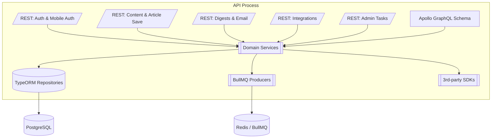

# C4 Level 3: API Component View

The API package (`packages/api`) currently co-locates Express routers, Apollo resolvers, and service classes. Responsibilities bleed across files, but natural seams already exist that map well to NestJS modules.

## Proposed Component Boundaries

| Proposed NestJS Module | Current Assets | Notes |
| --- | --- | --- |
| `AuthModule` | `auth_router`, `mobile_auth_router`, JWT helpers, SSO handlers | Centralize cookie/token issuance, unify mobile/web flows |
| `LibraryModule` | `article_router`, GraphQL resolvers under `library_item`, `highlights`, `labels` | Owns CRUD for saved content, tagging, reading progress |
| `IngestionModule` | Content save services, ContentWorker interfaces, queue producers | Separate HTTP ingestion from async processing, share DTOs |
| `DigestModule` | `digest_router`, email scheduler, service usage limits | Provide email digest scheduling, ensure rate limiting |
| `IntegrationModule` | `integration_router`, webhook handlers, third-party connectors | Use config-driven connectors, document credentials |
| `NotificationModule` | Push/email notifications, `notification_router` | Align with queue processors |
| `UserModule` | User CRUD, shortcuts, settings endpoints | Should surface GraphQL + REST parity |
| `ObservabilityModule` | Prometheus middleware, logging, Sentry bootstrap | Expose providers for metrics & tracing |

## What Exists vs. Missing

- **Routers & services** exist for every responsibility but lack composition: each file wires its own dependencies and does manual validation.
- **GraphQL schema** is rich but entangled with TypeORM entities and business logic inside resolvers.
- **Domain services** are plain functions (e.g., `createPageSaveRequest`, `applyRulesToLibraryItem`) without DI, making them hard to test in isolation.
- **Configuration & lifecycle** logic is scattered (`env.ts`, ad-hoc initialization in `server.ts`).
- **Background worker interfaces** (`ContentWorker`, queue processors) share logic via imports instead of contracts.

NestJS adoption should formalize these components into modules with explicit providers, DTO validation (`class-validator`), and unified exception filters.
