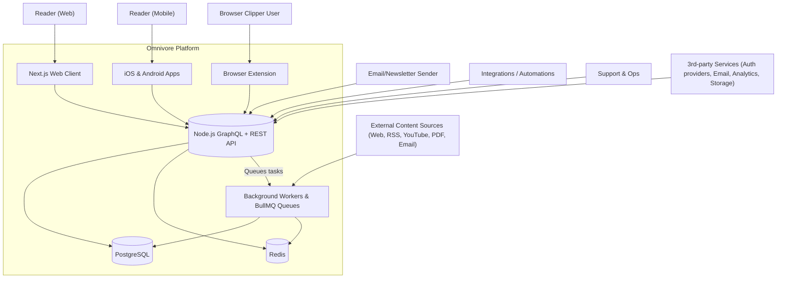

# C4 Level 1: System Context

The Omnivore platform helps readers capture, organize, and consume content across web, mobile, and email entry points. It integrates background processing and third-party services to enrich content and deliver personalized experiences.

## Observations

- The single API process fronts **both GraphQL** (Apollo) and **numerous REST endpoints**, acting as the integration hub for all clients.
- Background work (content parsing, enrichment, notifications) relies on BullMQ workers backed by Redis and Puppeteer-powered scraping.
- PostgreSQL is the system of record; Redis is used for queues and transient state.
- Multiple ingestion channels (browser extension, email, integrations) all fan into the same API/queue pipeline.

## Built vs. Missing

| Area | Current State | Gaps / Risks |
| --- | --- | --- |
| Core API | Express + Apollo server with modular routers and services | Lacks enforced domain boundaries, limited typing, manual lifecycle management |
| Background Processing | ContentWorker orchestrates parsing with Puppeteer, queue handlers in `queue-processor` | Error handling dispersed, scaling knobs manual, no central scheduler |
| Clients | Next.js web app, native mobile apps, browser extension present | Feature parity varies; API changes must avoid breaking older clients |
| Observability | Prometheus middleware, Winston logging, Sentry hooks (mostly disabled) | Sentry disabled, metrics limited to HTTP layer, tracing partial |
| Documentation | Scattered markdown, implicit architecture knowledge | No consolidated C4 views or migration guardrails (addressed by this doc set) |
| Deployment | Dockerfiles per service, docker-compose for dev, App Engine references | Need unified self-hosting story and production-ready container orchestration guidance |

This context view orients contributors before diving into container- and component-level discussions.
