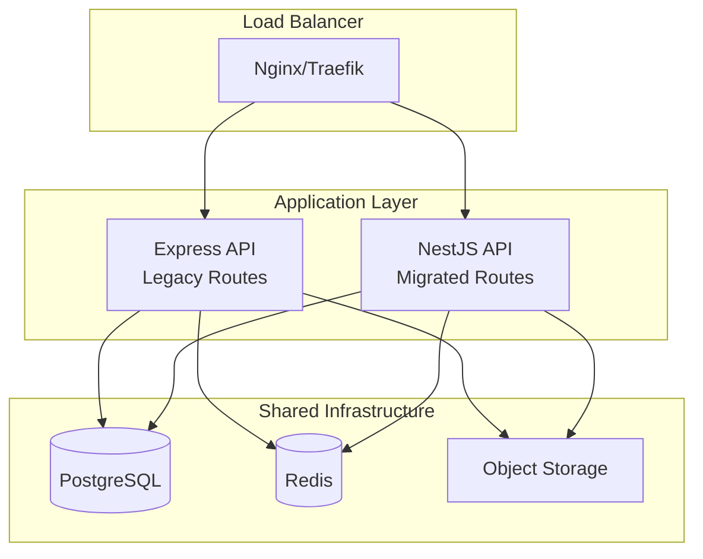
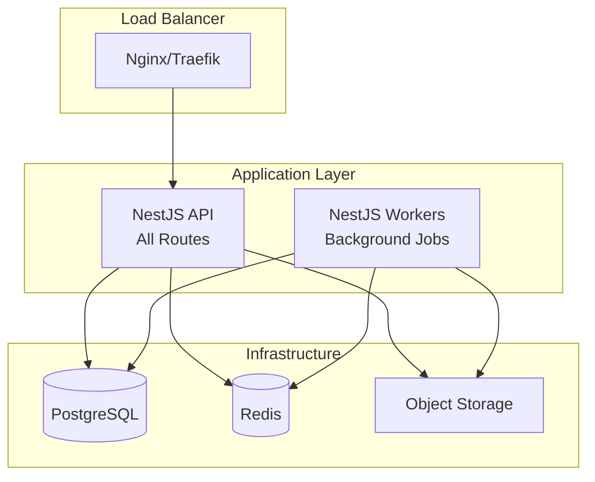

# NestJS Migration Deployment Strategy

## Overview

This document outlines comprehensive deployment strategies for the NestJS migration, covering production environments, self-hosting options, and the dual-stack deployment approach during the migration period.

## Deployment Architecture Evolution

### Phase 1: Dual-Stack Deployment



### Phase 2: Full NestJS Deployment



## Production Deployment Strategies

### Strategy 1: Blue-Green Deployment

#### Infrastructure Setup

```yaml
# docker-compose.production.yml
version: '3.8'

services:
  # Blue Environment (Current Express)
  api-blue:
    image: omnivore-api:${EXPRESS_VERSION}
    environment:
      - NODE_ENV=production
      - DEPLOYMENT_SLOT=blue
    networks:
      - omnivore-network
    labels:
      - 'traefik.enable=true'
      - 'traefik.http.routers.api-blue.rule=Host(`api.omnivore.app`) && HeadersRegexp(`X-Deployment-Slot`, `blue`)'

  # Green Environment (New NestJS)
  api-green:
    image: omnivore-nest-api:${NEST_VERSION}
    environment:
      - NODE_ENV=production
      - DEPLOYMENT_SLOT=green
    networks:
      - omnivore-network
    labels:
      - 'traefik.enable=true'
      - 'traefik.http.routers.api-green.rule=Host(`api.omnivore.app`) && HeadersRegexp(`X-Deployment-Slot`, `green`)'

  # Load Balancer with Traffic Splitting
  traefik:
    image: traefik:v3.0
    command:
      - '--api.insecure=true'
      - '--providers.docker=true'
      - '--entrypoints.web.address=:80'
      - '--entrypoints.websecure.address=:443'
    ports:
      - '80:80'
      - '443:443'
    volumes:
      - /var/run/docker.sock:/var/run/docker.sock
    networks:
      - omnivore-network

networks:
  omnivore-network:
    driver: bridge
```

#### Traffic Splitting Configuration

```yaml
# traefik/dynamic-config.yml
http:
  routers:
    api-router:
      rule: 'Host(`api.omnivore.app`)'
      service: api-weighted

  services:
    api-weighted:
      weighted:
        services:
          - name: api-blue
            weight: 90 # 90% to Express initially
          - name: api-green
            weight: 10 # 10% to NestJS initially

    api-blue:
      loadBalancer:
        servers:
          - url: 'http://api-blue:4000'

    api-green:
      loadBalancer:
        servers:
          - url: 'http://api-green:4001'
```

#### Progressive Traffic Migration

```bash
#!/bin/bash
# scripts/migrate-traffic.sh

# Phase 1: 10% traffic to NestJS
update_traffic_split() {
  local express_weight=$1
  local nest_weight=$2

  echo "Updating traffic split: Express ${express_weight}%, NestJS ${nest_weight}%"

  # Update Traefik configuration
  sed -i "s/weight: [0-9]*/weight: ${express_weight}/" traefik/api-blue.yml
  sed -i "s/weight: [0-9]*/weight: ${nest_weight}/" traefik/api-green.yml

  # Reload Traefik configuration
  docker exec traefik-container kill -USR1 1

  # Monitor metrics for 15 minutes
  monitor_metrics 900

  if [ $? -eq 0 ]; then
    echo "Traffic split successful"
  else
    echo "Rolling back traffic split"
    rollback_traffic
  fi
}

# Progressive migration schedule
update_traffic_split 90 10   # Week 1: 10% to NestJS
sleep 604800                  # Wait 1 week
update_traffic_split 70 30   # Week 2: 30% to NestJS
sleep 604800                  # Wait 1 week
update_traffic_split 50 50   # Week 3: 50% to NestJS
sleep 604800                  # Wait 1 week
update_traffic_split 20 80   # Week 4: 80% to NestJS
sleep 604800                  # Wait 1 week
update_traffic_split 0 100   # Week 5: 100% to NestJS
```

### Strategy 2: Kubernetes Deployment

#### Namespace and Resources

```yaml
# k8s/namespace.yml
apiVersion: v1
kind: Namespace
metadata:
  name: omnivore-migration
  labels:
    env: production
    migration: active
```

#### Express API Deployment

```yaml
# k8s/express-api-deployment.yml
apiVersion: apps/v1
kind: Deployment
metadata:
  name: omnivore-express-api
  namespace: omnivore-migration
  labels:
    app: omnivore-api
    version: express
spec:
  replicas: 3
  selector:
    matchLabels:
      app: omnivore-api
      version: express
  template:
    metadata:
      labels:
        app: omnivore-api
        version: express
    spec:
      containers:
        - name: api
          image: omnivore-api:latest
          ports:
            - containerPort: 4000
          env:
            - name: NODE_ENV
              value: 'production'
            - name: REDIS_URL
              valueFrom:
                secretKeyRef:
                  name: omnivore-secrets
                  key: redis-url
            - name: PG_HOST
              valueFrom:
                secretKeyRef:
                  name: omnivore-secrets
                  key: postgres-host
          resources:
            requests:
              memory: '256Mi'
              cpu: '250m'
            limits:
              memory: '512Mi'
              cpu: '500m'
          livenessProbe:
            httpGet:
              path: /api/healthz
              port: 4000
            initialDelaySeconds: 30
            periodSeconds: 10
          readinessProbe:
            httpGet:
              path: /api/healthz
              port: 4000
            initialDelaySeconds: 5
            periodSeconds: 5
```

#### NestJS API Deployment

```yaml
# k8s/nestjs-api-deployment.yml
apiVersion: apps/v1
kind: Deployment
metadata:
  name: omnivore-nest-api
  namespace: omnivore-migration
  labels:
    app: omnivore-api
    version: nestjs
spec:
  replicas: 2 # Start with fewer replicas
  selector:
    matchLabels:
      app: omnivore-api
      version: nestjs
  template:
    metadata:
      labels:
        app: omnivore-api
        version: nestjs
    spec:
      containers:
        - name: api
          image: omnivore-nest-api:latest
          ports:
            - containerPort: 4001
          env:
            - name: NODE_ENV
              value: 'production'
            - name: REDIS_URL
              valueFrom:
                secretKeyRef:
                  name: omnivore-secrets
                  key: redis-url
            - name: PG_HOST
              valueFrom:
                secretKeyRef:
                  name: omnivore-secrets
                  key: postgres-host
          resources:
            requests:
              memory: '128Mi' # NestJS is more efficient
              cpu: '100m'
            limits:
              memory: '256Mi'
              cpu: '250m'
          livenessProbe:
            httpGet:
              path: /api/healthz
              port: 4001
            initialDelaySeconds: 30
            periodSeconds: 10
          readinessProbe:
            httpGet:
              path: /api/healthz
              port: 4001
            initialDelaySeconds: 5
            periodSeconds: 5
```

#### Istio Service Mesh Configuration

```yaml
# k8s/istio-virtual-service.yml
apiVersion: networking.istio.io/v1beta1
kind: VirtualService
metadata:
  name: omnivore-api
  namespace: omnivore-migration
spec:
  hosts:
    - api.omnivore.app
  http:
    # Route specific endpoints to NestJS
    - match:
        - uri:
            prefix: /api/auth/
      route:
        - destination:
            host: omnivore-nest-api
            subset: nestjs
          weight: 100
    # Route remaining traffic based on weights
    - match:
        - uri:
            prefix: /api/
      route:
        - destination:
            host: omnivore-express-api
            subset: express
          weight: 80
        - destination:
            host: omnivore-nest-api
            subset: nestjs
          weight: 20
      fault:
        delay:
          percentage:
            value: 0.1
          fixedDelay: 5s # Chaos engineering

---
apiVersion: networking.istio.io/v1beta1
kind: DestinationRule
metadata:
  name: omnivore-api
  namespace: omnivore-migration
spec:
  host: omnivore-api
  subsets:
    - name: express
      labels:
        version: express
    - name: nestjs
      labels:
        version: nestjs
```

## Self-Hosting Deployment Options

### Option 1: Docker Compose (Recommended for Small Deployments)

#### Production-Ready Compose File

```yaml
# self-hosting/docker-compose.yml
version: '3.8'

services:
  # Reverse Proxy
  traefik:
    image: traefik:v3.0
    command:
      - '--api.dashboard=true'
      - '--providers.docker=true'
      - '--providers.docker.exposedbydefault=false'
      - '--entrypoints.web.address=:80'
      - '--entrypoints.websecure.address=:443'
      - '--certificatesresolvers.letsencrypt.acme.email=${ACME_EMAIL}'
      - '--certificatesresolvers.letsencrypt.acme.storage=/acme.json'
      - '--certificatesresolvers.letsencrypt.acme.httpchallenge=true'
      - '--certificatesresolvers.letsencrypt.acme.httpchallenge.entrypoint=web'
    ports:
      - '80:80'
      - '443:443'
      - '8080:8080' # Dashboard
    volumes:
      - /var/run/docker.sock:/var/run/docker.sock:ro
      - ./acme.json:/acme.json
    networks:
      - omnivore-network
    restart: unless-stopped

  # Express API (During Migration)
  api-express:
    image: omnivore/api:${EXPRESS_VERSION:-latest}
    environment:
      - NODE_ENV=production
      - REDIS_URL=redis://redis:6379
      - PG_HOST=postgres
      - PG_PORT=5432
      - PG_USER=${POSTGRES_USER}
      - PG_PASSWORD=${POSTGRES_PASSWORD}
      - PG_DATABASE=${POSTGRES_DB}
      - JWT_SECRET=${JWT_SECRET}
      - GOOGLE_CLIENT_ID=${GOOGLE_CLIENT_ID}
      - GOOGLE_CLIENT_SECRET=${GOOGLE_CLIENT_SECRET}
    depends_on:
      postgres:
        condition: service_healthy
      redis:
        condition: service_healthy
    networks:
      - omnivore-network
    restart: unless-stopped
    labels:
      - 'traefik.enable=true'
      - 'traefik.http.routers.api-express.rule=Host(`${DOMAIN}`) && PathPrefix(`/api`) && !PathPrefix(`/api/auth`)'
      - 'traefik.http.routers.api-express.entrypoints=websecure'
      - 'traefik.http.routers.api-express.tls.certresolver=letsencrypt'
      - 'traefik.http.services.api-express.loadbalancer.server.port=4000'

  # NestJS API (Migration Target)
  api-nest:
    image: omnivore/nest-api:${NEST_VERSION:-latest}
    environment:
      - NODE_ENV=production
      - REDIS_URL=redis://redis:6379
      - PG_HOST=postgres
      - PG_PORT=5432
      - PG_USER=${POSTGRES_USER}
      - PG_PASSWORD=${POSTGRES_PASSWORD}
      - PG_DATABASE=${POSTGRES_DB}
      - JWT_SECRET=${JWT_SECRET}
      - GOOGLE_CLIENT_ID=${GOOGLE_CLIENT_ID}
      - GOOGLE_CLIENT_SECRET=${GOOGLE_CLIENT_SECRET}
    depends_on:
      postgres:
        condition: service_healthy
      redis:
        condition: service_healthy
    networks:
      - omnivore-network
    restart: unless-stopped
    labels:
      - 'traefik.enable=true'
      - 'traefik.http.routers.api-nest.rule=Host(`${DOMAIN}`) && PathPrefix(`/api/auth`)'
      - 'traefik.http.routers.api-nest.entrypoints=websecure'
      - 'traefik.http.routers.api-nest.tls.certresolver=letsencrypt'
      - 'traefik.http.services.api-nest.loadbalancer.server.port=4001'

  # Web Client
  web:
    image: omnivore/web:${WEB_VERSION:-latest}
    environment:
      - NODE_ENV=production
      - NEXT_PUBLIC_API_URL=https://${DOMAIN}/api
    networks:
      - omnivore-network
    restart: unless-stopped
    labels:
      - 'traefik.enable=true'
      - 'traefik.http.routers.web.rule=Host(`${DOMAIN}`)'
      - 'traefik.http.routers.web.entrypoints=websecure'
      - 'traefik.http.routers.web.tls.certresolver=letsencrypt'

  # Background Workers
  workers:
    image: omnivore/workers:${WORKER_VERSION:-latest}
    environment:
      - NODE_ENV=production
      - REDIS_URL=redis://redis:6379
      - PG_HOST=postgres
      - PG_PORT=5432
      - PG_USER=${POSTGRES_USER}
      - PG_PASSWORD=${POSTGRES_PASSWORD}
      - PG_DATABASE=${POSTGRES_DB}
    depends_on:
      postgres:
        condition: service_healthy
      redis:
        condition: service_healthy
    networks:
      - omnivore-network
    restart: unless-stopped

  # PostgreSQL Database
  postgres:
    image: postgres:15-alpine
    environment:
      - POSTGRES_USER=${POSTGRES_USER}
      - POSTGRES_PASSWORD=${POSTGRES_PASSWORD}
      - POSTGRES_DB=${POSTGRES_DB}
    volumes:
      - postgres_data:/var/lib/postgresql/data
      - ./init-scripts:/docker-entrypoint-initdb.d
    networks:
      - omnivore-network
    restart: unless-stopped
    healthcheck:
      test: ['CMD-SHELL', 'pg_isready -U ${POSTGRES_USER}']
      interval: 10s
      timeout: 5s
      retries: 5

  # Redis Cache & Queues
  redis:
    image: redis:7-alpine
    command: redis-server --appendonly yes --maxmemory 512mb --maxmemory-policy allkeys-lru
    volumes:
      - redis_data:/data
    networks:
      - omnivore-network
    restart: unless-stopped
    healthcheck:
      test: ['CMD', 'redis-cli', 'ping']
      interval: 10s
      timeout: 3s
      retries: 5

  # Object Storage (MinIO)
  minio:
    image: minio/minio:latest
    command: server /data --console-address ":9001"
    environment:
      - MINIO_ROOT_USER=${MINIO_ACCESS_KEY}
      - MINIO_ROOT_PASSWORD=${MINIO_SECRET_KEY}
    volumes:
      - minio_data:/data
    networks:
      - omnivore-network
    restart: unless-stopped
    labels:
      - 'traefik.enable=true'
      - 'traefik.http.routers.minio-api.rule=Host(`storage.${DOMAIN}`)'
      - 'traefik.http.routers.minio-api.entrypoints=websecure'
      - 'traefik.http.routers.minio-api.tls.certresolver=letsencrypt'
      - 'traefik.http.services.minio-api.loadbalancer.server.port=9000'
      - 'traefik.http.routers.minio-console.rule=Host(`console.storage.${DOMAIN}`)'
      - 'traefik.http.routers.minio-console.entrypoints=websecure'
      - 'traefik.http.routers.minio-console.tls.certresolver=letsencrypt'
      - 'traefik.http.services.minio-console.loadbalancer.server.port=9001'

volumes:
  postgres_data:
  redis_data:
  minio_data:

networks:
  omnivore-network:
    driver: bridge
```

#### Environment Configuration

```bash
# self-hosting/.env.example
# Domain Configuration
DOMAIN=omnivore.example.com
ACME_EMAIL=admin@example.com

# Database Configuration
POSTGRES_USER=omnivore
POSTGRES_PASSWORD=your_secure_password_here
POSTGRES_DB=omnivore

# Application Secrets
JWT_SECRET=your_jwt_secret_here_minimum_32_characters
SESSION_SECRET=your_session_secret_here

# OAuth Configuration
GOOGLE_CLIENT_ID=your_google_client_id
GOOGLE_CLIENT_SECRET=your_google_client_secret

# Storage Configuration
MINIO_ACCESS_KEY=omnivore
MINIO_SECRET_KEY=your_minio_secret_key

# Version Tags
EXPRESS_VERSION=v1.0.0
NEST_VERSION=v2.0.0
WEB_VERSION=v1.0.0
WORKER_VERSION=v1.0.0
```

#### Deployment Script

```bash
#!/bin/bash
# self-hosting/deploy.sh

set -e

echo "🚀 Deploying Omnivore Self-Hosted Instance"

# Check prerequisites
command -v docker >/dev/null 2>&1 || { echo "❌ Docker is required but not installed."; exit 1; }
command -v docker-compose >/dev/null 2>&1 || { echo "❌ Docker Compose is required but not installed."; exit 1; }

# Load environment variables
if [ ! -f .env ]; then
    echo "❌ .env file not found. Please copy .env.example to .env and configure it."
    exit 1
fi

source .env

# Validate required variables
required_vars=("DOMAIN" "POSTGRES_PASSWORD" "JWT_SECRET")
for var in "${required_vars[@]}"; do
    if [ -z "${!var}" ]; then
        echo "❌ Required environment variable $var is not set"
        exit 1
    fi
done

# Create necessary directories
mkdir -p ./acme.json
chmod 600 ./acme.json

# Pull latest images
echo "📦 Pulling latest Docker images..."
docker-compose pull

# Start services
echo "🔄 Starting services..."
docker-compose up -d

# Wait for services to be healthy
echo "⏳ Waiting for services to be healthy..."
timeout 300 bash -c 'until docker-compose ps | grep -q "healthy"; do sleep 5; done'

# Run database migrations
echo "🗄️ Running database migrations..."
docker-compose exec api-express npm run db:migrate

# Check service health
echo "🏥 Checking service health..."
services=("api-express" "api-nest" "web" "workers" "postgres" "redis" "minio")
for service in "${services[@]}"; do
    if docker-compose ps $service | grep -q "Up"; then
        echo "✅ $service is running"
    else
        echo "❌ $service is not running"
        exit 1
    fi
done

echo "🎉 Deployment complete!"
echo "📍 Your Omnivore instance is available at: https://${DOMAIN}"
echo "🔧 MinIO Console: https://console.storage.${DOMAIN}"
echo "📊 Traefik Dashboard: http://${DOMAIN}:8080"
```

### Option 2: Single-Server Deployment

#### Optimized Compose for Resource-Constrained Environments

```yaml
# self-hosting/docker-compose.minimal.yml
version: '3.8'

services:
  # Combined API (NestJS only after migration)
  api:
    image: omnivore/nest-api:latest
    environment:
      - NODE_ENV=production
      - REDIS_URL=redis://redis:6379
      - PG_HOST=postgres
      - PG_PORT=5432
      - PG_USER=${POSTGRES_USER}
      - PG_PASSWORD=${POSTGRES_PASSWORD}
      - PG_DATABASE=${POSTGRES_DB}
      - ENABLE_WORKERS=true # Run workers in same process
    ports:
      - '4000:4000'
    depends_on:
      - postgres
      - redis
    restart: unless-stopped
    deploy:
      resources:
        limits:
          memory: 512M
        reservations:
          memory: 256M

  # Web Client (Static Build)
  web:
    image: nginx:alpine
    volumes:
      - web_build:/usr/share/nginx/html
    ports:
      - '3000:80'
    restart: unless-stopped
    deploy:
      resources:
        limits:
          memory: 64M
        reservations:
          memory: 32M

  # PostgreSQL (Minimal Configuration)
  postgres:
    image: postgres:15-alpine
    environment:
      - POSTGRES_USER=${POSTGRES_USER}
      - POSTGRES_PASSWORD=${POSTGRES_PASSWORD}
      - POSTGRES_DB=${POSTGRES_DB}
      - POSTGRES_INITDB_ARGS=--data-checksums
    volumes:
      - postgres_data:/var/lib/postgresql/data
    restart: unless-stopped
    deploy:
      resources:
        limits:
          memory: 256M
        reservations:
          memory: 128M

  # Redis (Minimal Configuration)
  redis:
    image: redis:7-alpine
    command: redis-server --maxmemory 128mb --maxmemory-policy allkeys-lru
    volumes:
      - redis_data:/data
    restart: unless-stopped
    deploy:
      resources:
        limits:
          memory: 128M
        reservations:
          memory: 64M

volumes:
  postgres_data:
  redis_data:
  web_build:
```

## Migration Deployment Timeline

### Week 1-2: Infrastructure Preparation

```bash
# Phase 1: Set up dual-stack infrastructure
./scripts/setup-infrastructure.sh

# Deploy both Express and NestJS APIs
docker-compose -f docker-compose.migration.yml up -d

# Configure load balancer with 95% Express, 5% NestJS
./scripts/configure-traffic-split.sh 95 5
```

### Week 3-4: Authentication Migration

```bash
# Phase 2: Migrate authentication endpoints
./scripts/deploy-auth-migration.sh

# Update traffic split: 90% Express, 10% NestJS
./scripts/configure-traffic-split.sh 90 10

# Monitor authentication metrics
./scripts/monitor-auth-metrics.sh
```

### Week 5-8: Progressive Feature Migration

```bash
# Phase 3-6: Migrate remaining features
for phase in library ingestion queues notifications; do
    echo "Migrating $phase..."
    ./scripts/deploy-$phase-migration.sh

    # Gradually increase NestJS traffic
    ./scripts/increase-nest-traffic.sh

    # Monitor for 48 hours before next phase
    ./scripts/monitor-migration.sh 48h
done
```

### Week 9: Full Cutover

```bash
# Phase 7: Complete migration
./scripts/complete-migration.sh

# Route 100% traffic to NestJS
./scripts/configure-traffic-split.sh 0 100

# Decommission Express API
./scripts/decommission-express.sh
```

## Monitoring and Rollback Procedures

### Health Check Endpoints

```typescript
// health-check.controller.ts
@Controller('health')
export class HealthController {
  @Get()
  getHealth(): HealthCheckResult {
    return {
      status: 'healthy',
      timestamp: new Date().toISOString(),
      version: process.env.APP_VERSION,
      uptime: process.uptime(),
      migration: {
        phase: process.env.MIGRATION_PHASE,
        expressActive: process.env.EXPRESS_ACTIVE === 'true',
        nestActive: process.env.NEST_ACTIVE === 'true',
      },
    }
  }

  @Get('deep')
  @HealthCheck()
  getDeepHealth(
    @HealthCheckService() health: HealthCheckService,
    @InjectRepository(User) userRepo: Repository<User>
  ) {
    return health.check([
      () => this.database.pingCheck('database', { userRepo }),
      () => this.redis.pingCheck('redis'),
      () => this.storage.pingCheck('storage'),
    ])
  }
}
```

### Automated Rollback Script

```bash
#!/bin/bash
# scripts/emergency-rollback.sh

echo "🚨 EMERGENCY ROLLBACK INITIATED"

# Immediately route all traffic to Express
echo "Routing 100% traffic to Express..."
./scripts/configure-traffic-split.sh 100 0

# Stop NestJS containers
echo "Stopping NestJS containers..."
docker-compose stop api-nest workers-nest

# Restart Express containers if needed
echo "Ensuring Express containers are healthy..."
docker-compose restart api-express workers-express

# Verify rollback
echo "Verifying rollback..."
if curl -f http://localhost/api/healthz; then
    echo "✅ Rollback successful"
else
    echo "❌ Rollback failed - manual intervention required"
    exit 1
fi

# Send alerts
./scripts/send-rollback-alert.sh
```

## Security Considerations

### SSL/TLS Configuration

```yaml
# traefik/tls-config.yml
tls:
  options:
    default:
      minVersion: 'VersionTLS12'
      cipherSuites:
        - 'TLS_ECDHE_RSA_WITH_AES_256_GCM_SHA384'
        - 'TLS_ECDHE_RSA_WITH_CHACHA20_POLY1305'
        - 'TLS_ECDHE_RSA_WITH_AES_128_GCM_SHA256'
      curvePreferences:
        - 'CurveP521'
        - 'CurveP384'
```

### Network Security

```yaml
# docker-compose.security.yml
networks:
  omnivore-network:
    driver: bridge
    ipam:
      config:
        - subnet: 172.20.0.0/16
    driver_opts:
      com.docker.network.bridge.enable_icc: 'false'
      com.docker.network.bridge.enable_ip_masquerade: 'true'
```

### Secret Management

```bash
# scripts/setup-secrets.sh
#!/bin/bash

# Generate secure secrets
JWT_SECRET=$(openssl rand -base64 32)
SESSION_SECRET=$(openssl rand -base64 32)
POSTGRES_PASSWORD=$(openssl rand -base64 16)

# Store in Docker secrets
echo "$JWT_SECRET" | docker secret create jwt_secret -
echo "$SESSION_SECRET" | docker secret create session_secret -
echo "$POSTGRES_PASSWORD" | docker secret create postgres_password -
```

## Cost Optimization

### Resource Allocation

| Service     | CPU (cores) | Memory (MB) | Storage (GB) |
| ----------- | ----------- | ----------- | ------------ |
| Express API | 0.5         | 512         | -            |
| NestJS API  | 0.25        | 256         | -            |
| Workers     | 0.25        | 256         | -            |
| PostgreSQL  | 0.5         | 512         | 20           |
| Redis       | 0.1         | 128         | 2            |
| Web Client  | 0.1         | 64          | -            |

### Scaling Strategy

```yaml
# docker-compose.scaling.yml
services:
  api-nest:
    deploy:
      replicas: 2
      update_config:
        parallelism: 1
        delay: 30s
        failure_action: rollback
      restart_policy:
        condition: on-failure
        delay: 5s
        max_attempts: 3
```

This comprehensive deployment strategy ensures a smooth, secure, and reliable migration to NestJS while maintaining production stability and providing flexible self-hosting options.
