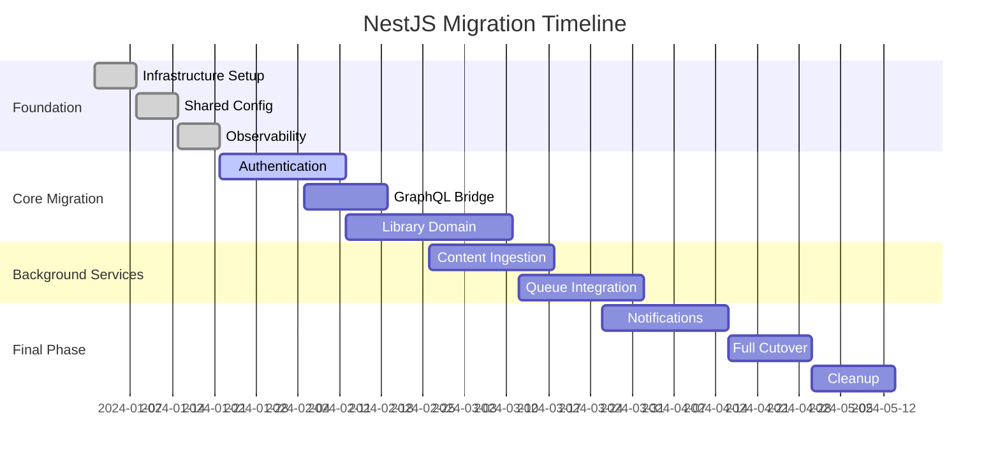
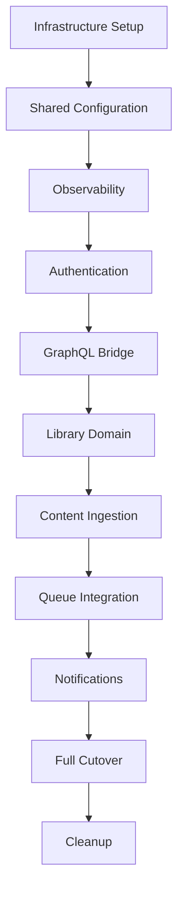

# NestJS Migration Implementation Timeline

## Executive Summary

This document provides a detailed, week-by-week implementation timeline for the NestJS migration, including milestones, deliverables, testing requirements, and risk mitigation strategies. The migration is designed as an 18-week project with parallel workstreams and incremental delivery.

## Timeline Overview



## Phase-by-Phase Implementation

### Phase 0: Foundation (Weeks 1-3)

#### Week 1: Infrastructure Setup (ARC-001)

**Objective**: Establish NestJS skeleton and dual-stack capability

##### Monday - Tuesday: Project Scaffolding

- [ ] Create `packages/api-nest` directory structure
- [ ] Set up NestJS project with CLI: `nest new api-nest`
- [ ] Configure TypeScript with strict settings
- [ ] Set up shared tsconfig extending from workspace root
- [ ] Create initial `AppModule` and `main.ts`

```typescript
// packages/api-nest/src/main.ts
import { NestFactory } from '@nestjs/core'
import { AppModule } from './app.module'
import { ValidationPipe } from '@nestjs/common'

async function bootstrap() {
  const app = await NestFactory.create(AppModule)

  app.useGlobalPipes(
    new ValidationPipe({
      whitelist: true,
      forbidNonWhitelisted: true,
      transform: true,
    })
  )

  app.setGlobalPrefix('api/v2')

  await app.listen(process.env.PORT || 4001)
  console.log(`🚀 NestJS API running on port ${process.env.PORT || 4001}`)
}

bootstrap()
```

##### Wednesday - Thursday: Docker Integration

- [ ] Create `Dockerfile` for NestJS application
- [ ] Update `docker-compose.yml` to include NestJS service
- [ ] Configure development environment variables
- [ ] Test dual-stack deployment (Express + NestJS)

```dockerfile
# packages/api-nest/Dockerfile
FROM node:22-alpine AS builder

WORKDIR /app
COPY package*.json ./
RUN npm ci --only=production

COPY . .
RUN npm run build

FROM node:22-alpine AS runtime

WORKDIR /app
COPY --from=builder /app/dist ./dist
COPY --from=builder /app/node_modules ./node_modules
COPY package*.json ./

EXPOSE 4001

CMD ["node", "dist/main"]
```

##### Friday: Health Checks & CI Integration

- [ ] Implement health check endpoints
- [ ] Add NestJS build to CI pipeline
- [ ] Create initial E2E test
- [ ] Document setup process

**Deliverables**:

- ✅ NestJS application boots successfully
- ✅ Health endpoints respond (`/api/v2/health`)
- ✅ Docker Compose supports dual-stack
- ✅ CI pipeline builds both applications

#### Week 2: Shared Configuration (ARC-002)

**Objective**: Centralize configuration management

##### Monday - Tuesday: Configuration Extraction

- [ ] Create `packages/shared/config` module
- [ ] Extract environment schema from Express
- [ ] Implement typed configuration with validation
- [ ] Create configuration factory

```typescript
// packages/shared/config/src/configuration.ts
import { registerAs } from '@nestjs/config'
import { IsString, IsNumber, IsOptional, validateSync } from 'class-validator'
import { plainToClass } from 'class-transformer'

class DatabaseConfig {
  @IsString()
  host: string

  @IsNumber()
  port: number

  @IsString()
  username: string

  @IsString()
  password: string

  @IsString()
  database: string
}

class AppConfig {
  database: DatabaseConfig

  @IsString()
  jwtSecret: string

  @IsOptional()
  @IsString()
  sentryDsn?: string
}

export default registerAs('app', (): AppConfig => {
  const config = plainToClass(AppConfig, {
    database: {
      host: process.env.PG_HOST,
      port: parseInt(process.env.PG_PORT || '5432'),
      username: process.env.PG_USER,
      password: process.env.PG_PASSWORD,
      database: process.env.PG_DATABASE,
    },
    jwtSecret: process.env.JWT_SECRET,
    sentryDsn: process.env.SENTRY_DSN,
  })

  const errors = validateSync(config)
  if (errors.length > 0) {
    throw new Error(`Configuration validation failed: ${errors}`)
  }

  return config
})
```

##### Wednesday - Thursday: Express Integration

- [ ] Update Express to use shared configuration
- [ ] Ensure identical config between stacks
- [ ] Create configuration tests
- [ ] Update documentation

##### Friday: Testing & Validation

- [ ] Contract tests for configuration
- [ ] Environment validation tests
- [ ] Integration testing

**Deliverables**:

- ✅ Shared configuration module
- ✅ Both stacks use identical configuration
- ✅ Configuration validation at startup
- ✅ Contract tests passing

#### Week 3: Observability Setup (ARC-003)

**Objective**: Implement monitoring and logging

##### Monday - Tuesday: Metrics & Logging

- [ ] Set up Prometheus metrics collection
- [ ] Configure structured logging with Winston
- [ ] Implement request/response logging middleware
- [ ] Create observability module

```typescript
// packages/api-nest/src/observability/observability.module.ts
import { Module } from '@nestjs/common'
import { PrometheusModule } from '@willsoto/nestjs-prometheus'
import { LoggerModule } from 'nestjs-pino'

@Module({
  imports: [
    PrometheusModule.register({
      path: '/metrics',
      defaultMetrics: {
        enabled: true,
      },
    }),
    LoggerModule.forRoot({
      pinoHttp: {
        transport: {
          target: 'pino-pretty',
          options: {
            singleLine: true,
          },
        },
      },
    }),
  ],
})
export class ObservabilityModule {}
```

##### Wednesday - Thursday: Error Monitoring

- [ ] Integrate Sentry for error tracking
- [ ] Set up error context collection
- [ ] Create custom exception filters
- [ ] Test error reporting

##### Friday: Dashboard Setup

- [ ] Configure Grafana dashboards
- [ ] Set up alerting rules
- [ ] Test monitoring in staging
- [ ] Document observability setup

**Deliverables**:

- ✅ Prometheus metrics from both stacks
- ✅ Structured logging consistency
- ✅ Sentry error reporting functional
- ✅ Monitoring dashboards operational

### Phase 1: Authentication Migration (Weeks 4-6)

#### Week 4: Authentication Core (ARC-004)

**Objective**: Migrate authentication endpoints with zero regression

##### Monday - Tuesday: Module Setup

- [ ] Create `AuthModule` with controllers and services
- [ ] Implement JWT strategy with Passport
- [ ] Create authentication guards
- [ ] Set up DTO validation

```typescript
// packages/api-nest/src/auth/auth.module.ts
@Module({
  imports: [
    JwtModule.registerAsync({
      useFactory: (config: ConfigType<typeof appConfig>) => ({
        secret: config.auth.jwtSecret,
        signOptions: { expiresIn: config.auth.jwtExpiresIn },
      }),
      inject: [appConfig.KEY],
    }),
    PassportModule,
  ],
  controllers: [AuthController],
  providers: [AuthService, JwtStrategy, GoogleStrategy, AppleStrategy],
  exports: [AuthService],
})
export class AuthModule {}
```

##### Wednesday - Thursday: OAuth Integration

- [ ] Implement Google OAuth strategy
- [ ] Implement Apple Sign-In strategy
- [ ] Create OAuth callback handlers
- [ ] Test OAuth flows

##### Friday: Testing & Validation

- [ ] Unit tests for authentication services
- [ ] Integration tests for auth endpoints
- [ ] Contract tests vs Express implementation
- [ ] Security testing

**Deliverables**:

- ✅ AuthModule with all strategies
- ✅ JWT and OAuth implementations
- ✅ Comprehensive test coverage
- ✅ Security validation complete

#### Week 5: Mobile Authentication (ARC-004 continued)

**Objective**: Migrate mobile-specific authentication

##### Monday - Tuesday: Mobile Auth Endpoints

- [ ] Implement mobile authentication controller
- [ ] Create mobile-specific DTOs
- [ ] Handle device registration
- [ ] Test mobile auth flows

##### Wednesday - Thursday: Session Management

- [ ] Implement session management
- [ ] Create session guards
- [ ] Handle session refresh
- [ ] Test session persistence

##### Friday: Load Balancer Configuration

- [ ] Configure proxy rules for auth endpoints
- [ ] Set up traffic splitting (95% Express, 5% NestJS)
- [ ] Test routing configuration
- [ ] Monitor auth metrics

**Deliverables**:

- ✅ Mobile authentication endpoints
- ✅ Session management system
- ✅ Traffic routing to NestJS auth
- ✅ Authentication metrics monitoring

#### Week 6: Authentication Stabilization

**Objective**: Ensure authentication stability before next phase

##### Monday - Tuesday: Performance Testing

- [ ] Load testing authentication endpoints
- [ ] Performance comparison with Express
- [ ] Optimize authentication performance
- [ ] Benchmark results

##### Wednesday - Thursday: Security Audit

- [ ] Security review of authentication implementation
- [ ] Penetration testing
- [ ] Fix security findings
- [ ] Document security measures

##### Friday: Production Readiness

- [ ] Increase NestJS traffic to 10%
- [ ] Monitor production metrics
- [ ] Create runbooks for auth issues
- [ ] Team training on new auth system

**Deliverables**:

- ✅ Authentication performance optimized
- ✅ Security audit passed
- ✅ 10% production traffic handling
- ✅ Team trained on new system

### Phase 2: GraphQL Bridge (Weeks 7-8)

#### Week 7: Schema Stitching Setup (ARC-005)

**Objective**: Create unified GraphQL endpoint

##### Monday - Tuesday: GraphQL Module Setup

- [ ] Configure NestJS GraphQL module
- [ ] Set up Apollo Server with schema stitching
- [ ] Create base schema in NestJS
- [ ] Test schema federation

```typescript
// packages/api-nest/src/graphql/graphql.module.ts
@Module({
  imports: [
    GraphQLModule.forRootAsync<ApolloGatewayDriverConfig>({
      driver: ApolloGatewayDriver,
      useFactory: () => ({
        gateway: {
          buildService({ name, url }) {
            return new RemoteGraphQLDataSource({
              url,
              willSendRequest({ request, context }) {
                request.http.headers.set('authorization', context.authorization)
              },
            })
          },
          supergraphSdl: buildSupergraphSchema(),
        },
      }),
    }),
  ],
})
export class GraphQLModule {}
```

##### Wednesday - Thursday: Schema Integration

- [ ] Integrate Express GraphQL schema
- [ ] Create schema delegation
- [ ] Test query routing
- [ ] Handle authentication context

##### Friday: Testing & Validation

- [ ] GraphQL contract tests
- [ ] Query performance testing
- [ ] Error handling validation
- [ ] Documentation updates

**Deliverables**:

- ✅ Unified GraphQL endpoint
- ✅ Schema stitching functional
- ✅ Authentication context passing
- ✅ Contract tests passing

#### Week 8: First Resolver Migration

**Objective**: Migrate first set of GraphQL resolvers

##### Monday - Tuesday: Viewer Query Migration

- [ ] Implement viewer resolver in NestJS
- [ ] Create user service
- [ ] Test resolver functionality
- [ ] Performance comparison

##### Wednesday - Thursday: Schema Testing

- [ ] Comprehensive GraphQL testing
- [ ] Client compatibility testing
- [ ] Performance benchmarking
- [ ] Error handling validation

##### Friday: Production Deployment

- [ ] Deploy GraphQL bridge to production
- [ ] Monitor GraphQL metrics
- [ ] Validate client compatibility
- [ ] Create GraphQL runbooks

**Deliverables**:

- ✅ First NestJS resolver in production
- ✅ GraphQL bridge stable
- ✅ Client compatibility maintained
- ✅ Performance benchmarks met

### Phase 3: Library Domain Migration (Weeks 9-12)

#### Week 9-10: Core Library Features (ARC-006)

**Objective**: Migrate article and library management

##### Week 9: Article Management

- [ ] Create `LibraryModule` structure
- [ ] Implement article services
- [ ] Migrate article CRUD operations
- [ ] Create article DTOs and validation

```typescript
// packages/api-nest/src/library/library.service.ts
@Injectable()
export class LibraryService {
  constructor(
    @InjectRepository(LibraryItem) private libraryRepo: Repository<LibraryItem>,
    private contentService: ContentService,
    private queueService: QueueService
  ) {}

  async saveArticle(url: string, userId: string): Promise<LibraryItem> {
    // Validate URL
    if (!this.isValidUrl(url)) {
      throw new BadRequestException('Invalid URL format')
    }

    // Check if article already exists
    const existing = await this.libraryRepo.findOne({
      where: { url, user: { id: userId } },
    })

    if (existing) {
      return existing
    }

    // Create library item
    const libraryItem = this.libraryRepo.create({
      url,
      user: { id: userId },
      status: 'PROCESSING',
    })

    await this.libraryRepo.save(libraryItem)

    // Queue content processing
    await this.queueService.addContentJob({
      libraryItemId: libraryItem.id,
      url,
    })

    return libraryItem
  }
}
```

##### Week 10: Search and Filtering

- [ ] Implement search functionality
- [ ] Create filtering and sorting
- [ ] Migrate library queries
- [ ] Performance optimization

#### Week 11-12: Advanced Library Features

##### Week 11: Labels and Highlights

- [ ] Implement label management
- [ ] Create highlight system
- [ ] Migrate annotation features
- [ ] Test data consistency

##### Week 12: Library GraphQL

- [ ] Migrate library GraphQL resolvers
- [ ] Test GraphQL mutations
- [ ] Performance optimization
- [ ] Client compatibility testing

**Deliverables**:

- ✅ Complete library domain in NestJS
- ✅ All library endpoints migrated
- ✅ GraphQL resolvers functional
- ✅ Performance parity achieved

### Phase 4: Content Ingestion (Weeks 13-15)

#### Week 13: Ingestion Module (ARC-007)

**Objective**: Migrate content ingestion endpoints

##### Monday - Wednesday: HTTP Ingestion

- [ ] Create `IngestionModule`
- [ ] Implement content save endpoints
- [ ] Migrate pubsub endpoints
- [ ] Test ingestion flows

##### Thursday - Friday: Queue Integration

- [ ] Implement BullMQ producers
- [ ] Create job scheduling
- [ ] Test queue integration
- [ ] Monitor job processing

#### Week 14: Queue Workers (ARC-008)

**Objective**: Migrate background workers to NestJS

##### Monday - Tuesday: Worker Setup

- [ ] Create `QueueModule` with BullMQ
- [ ] Implement content processing workers
- [ ] Migrate job handlers
- [ ] Test worker functionality

```typescript
// packages/api-nest/src/queue/queue.module.ts
@Module({
  imports: [
    BullModule.forRootAsync({
      useFactory: (config: ConfigType<typeof appConfig>) => ({
        redis: {
          host: config.redis.host,
          port: config.redis.port,
        },
      }),
      inject: [appConfig.KEY],
    }),
    BullModule.registerQueue({
      name: 'content-processing',
    }),
  ],
  providers: [ContentProcessor],
})
export class QueueModule {}
```

##### Wednesday - Friday: Worker Migration

- [ ] Migrate all background workers
- [ ] Test job processing
- [ ] Performance optimization
- [ ] Error handling validation

#### Week 15: Ingestion Stabilization

##### Monday - Wednesday: Testing & Optimization

- [ ] Load testing ingestion endpoints
- [ ] Queue performance testing
- [ ] Error handling validation
- [ ] Monitoring setup

##### Thursday - Friday: Production Deployment

- [ ] Deploy ingestion module
- [ ] Increase traffic to NestJS (50%)
- [ ] Monitor ingestion metrics
- [ ] Validate content processing

**Deliverables**:

- ✅ Content ingestion fully migrated
- ✅ Background workers in NestJS
- ✅ 50% traffic on NestJS
- ✅ Performance maintained

### Phase 5: Final Migration (Weeks 16-18)

#### Week 16: Notifications & Integrations (ARC-009)

**Objective**: Migrate remaining services

##### Monday - Tuesday: Digest Module

- [ ] Create `DigestModule`
- [ ] Implement digest generation
- [ ] Migrate cron jobs
- [ ] Test email delivery

##### Wednesday - Thursday: Notification Module

- [ ] Create `NotificationModule`
- [ ] Implement push notifications
- [ ] Migrate notification endpoints
- [ ] Test notification delivery

##### Friday: Integration Module

- [ ] Create `IntegrationModule`
- [ ] Migrate webhook handlers
- [ ] Test third-party integrations
- [ ] Validate webhook delivery

#### Week 17: Full Cutover (ARC-010)

**Objective**: Complete migration to NestJS

##### Monday - Tuesday: Traffic Migration

- [ ] Increase NestJS traffic to 80%
- [ ] Monitor all metrics
- [ ] Validate system stability
- [ ] Prepare for full cutover

##### Wednesday - Thursday: Final Cutover

- [ ] Route 100% traffic to NestJS
- [ ] Stop Express services
- [ ] Monitor system stability
- [ ] Validate all functionality

##### Friday: Express Decommission

- [ ] Remove Express containers
- [ ] Clean up routing rules
- [ ] Update documentation
- [ ] Celebrate migration success! 🎉

#### Week 18: Cleanup & Optimization

**Objective**: Finalize migration and optimize

##### Monday - Tuesday: Code Cleanup

- [ ] Remove Express codebase
- [ ] Clean up Docker configurations
- [ ] Update CI/CD pipelines
- [ ] Remove dual-stack complexity

##### Wednesday - Thursday: Documentation

- [ ] Update all documentation
- [ ] Create migration retrospective
- [ ] Document lessons learned
- [ ] Update deployment guides

##### Friday: Performance Optimization

- [ ] Final performance tuning
- [ ] Resource optimization
- [ ] Monitoring refinement
- [ ] Team celebration

**Final Deliverables**:

- ✅ 100% traffic on NestJS
- ✅ Express completely decommissioned
- ✅ All documentation updated
- ✅ Performance optimized

## Risk Mitigation & Contingencies

### Critical Path Dependencies



### Risk Mitigation Strategies

#### High-Risk Activities

1. **Authentication Migration (Week 4-6)**

   - **Risk**: User login failures
   - **Mitigation**: Gradual traffic increase, instant rollback capability
   - **Contingency**: Keep Express auth active for 2 weeks after migration

2. **GraphQL Schema Stitching (Week 7-8)**

   - **Risk**: Client compatibility issues
   - **Mitigation**: Extensive client testing, schema validation
   - **Contingency**: Fallback to Express GraphQL endpoint

3. **Full Cutover (Week 17)**
   - **Risk**: System instability
   - **Mitigation**: Blue-green deployment, comprehensive monitoring
   - **Contingency**: Immediate rollback to Express

#### Buffer Time Allocation

- **Authentication**: +1 week buffer
- **GraphQL**: +1 week buffer
- **Library Domain**: +2 weeks buffer
- **Final Cutover**: +1 week buffer

### Success Metrics

#### Technical Metrics

- **Performance**: Response times ≤ Express baseline
- **Reliability**: 99.9% uptime during migration
- **Test Coverage**: ≥80% for all new NestJS modules
- **Error Rate**: ≤0.5% across all endpoints

#### Business Metrics

- **User Experience**: Zero user-reported regressions
- **Feature Velocity**: 60% improvement post-migration
- **Maintenance Overhead**: 40% reduction
- **Developer Satisfaction**: ≥8/10 in post-migration survey

### Communication Plan

#### Weekly Status Updates

- **Audience**: Engineering team, product, leadership
- **Content**: Progress, blockers, risks, next week's plan
- **Format**: Written summary + 15-min standup

#### Milestone Reviews

- **Frequency**: After each major phase
- **Participants**: Tech lead, engineering manager, architect
- **Deliverables**: Go/no-go decision for next phase

#### Incident Communication

- **Critical Issues**: Immediate Slack notification
- **Status Updates**: Every 30 minutes during incidents
- **Post-Incident**: Full retrospective within 48 hours

## Conclusion

This 18-week migration timeline provides a structured, risk-aware approach to migrating Omnivore from Express to NestJS. The phased approach ensures minimal disruption to users while delivering significant architectural improvements.

Key success factors:

- ✅ **Incremental delivery** with early feedback
- ✅ **Comprehensive testing** at each phase
- ✅ **Risk mitigation** with rollback capabilities
- ✅ **Team alignment** through clear communication
- ✅ **Production stability** throughout migration

The migration will position Omnivore for accelerated development, improved reliability, and sustainable growth.
