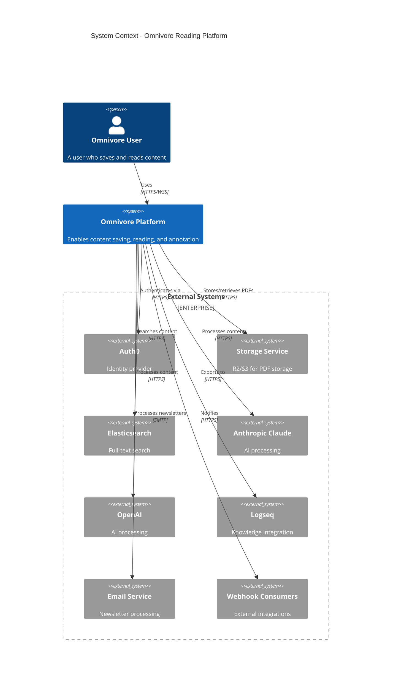
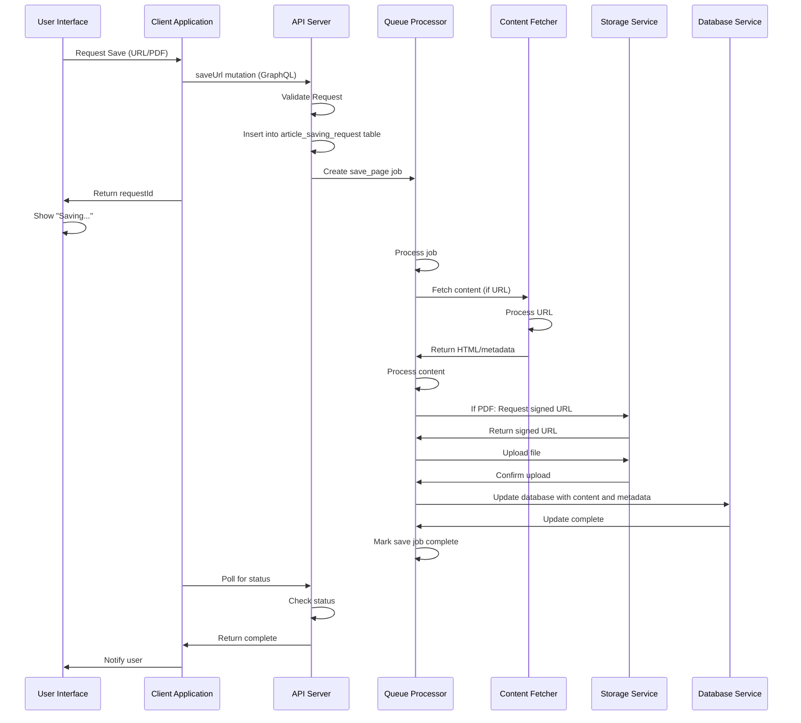
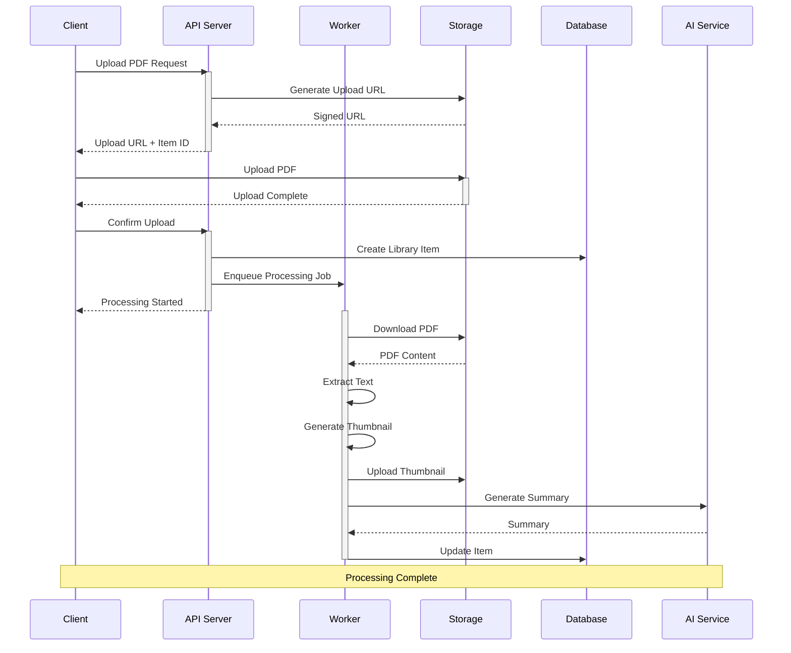

# Enhancing Omnivore: Multi-Content Support, Companion Tools & Ethical Monetization

**Introduction:**

Omnivore – a free, open-source read-it-later app – has a strong foundation for reading and annotating text articles

[docs.omnivore.app](https://docs.omnivore.app/#:~:text=,Chrome%2C%20Safari%2C%20Firefox%2C%20and%20Edge)

. To expand its appeal and longevity, Omnivore can evolve beyond text-only content. This strategic report outlines opportunities to support additional content types (audio, video, PDFs, etc.), proposes companion tools for seamless content capture, suggests premium features to sustain development, and recommends ethical monetization paths. The goal is to broaden Omnivore’s capabilities while honoring its open-source values and keeping the core experience free.

## Expanding Core Functionality to Multiple Content Types

Omnivore can become a true **“omnivore” of content** by handling media beyond web articles. Key expansion opportunities include:

### 1. Audiobooks and Long-Form Audio

**Opportunity:** Enable users to save and engage with audiobooks or other lengthy audio content in Omnivore, treating them as first-class citizens alongside text articles. This could involve letting users add audiobook files/links to their library, track listening progress, and capture notes or quotes from them.

**Implementation Ideas:**

- **Transcripts & Textual View:** Offer an AI-powered transcript for uploaded audiobook files (when legally permissible). Using open-source speech-to-text (e.g. Whisper) to generate text would let users read or search an audiobook’s content. For copyrighted books, perhaps limit transcript length or require the user to own the text (to avoid full unauthorized reproduction).
    
    [github.com](https://github.com/omnivore-app/omnivore/issues/3736#:~:text=I%20use%20PocketCasts,which%20opens%20a%20HTML%20page)
    
- **Highlighting & Notes:** Allow time-based highlights in the audio (like bookmarks) which link to the corresponding transcript text. Users could select a snippet of the transcript and save it as a highlight with the timestamp. This mirrors how Snipd (a podcast app) lets listeners capture “snips” from audio for later review.
    
    [snipd.com](https://www.snipd.com/#:~:text=Save%20Key%20Insights%2C%20Automatically)
    
    [snipd.com](https://www.snipd.com/#:~:text=)
    
- **Bi-Directional Sync with eBooks:** If a user has the eBook (text) version of an audiobook, Omnivore could sync positions between the audio and text. For example, as they listen to chapter 3 of an audiobook, the eBook text scrolls or marks that chapter. This would require aligning the audiobook with the text (perhaps via chapter timings or whisper alignment tools).
- **User Experience:** Omnivore’s interface can include a simple audio player (play, pause, 30-second skip) for audiobooks. Progress (current timestamp) should sync across devices just like reading position does for long articles. Users could toggle between **“Listen”** and **“Read”** modes. In **Read mode**, they see the transcript (if available) and can highlight text; in **Listen mode**, they get playback controls and maybe the scrolling text.
    
    [docs.omnivore.app](https://docs.omnivore.app/#:~:text=,Browser%20extensions%20for%20Chrome%2C%20Safari)
    

**Why it’s Valuable:** Many users consume books via audio for convenience. Supporting audiobooks would let Omnivore serve as a unified library for both what you *read* and what you *listen to*. It taps into the growing audiobook market while leveraging Omnivore’s strength in notes/highlights. Notably, the Snipd app has expanded beyond podcasts to allow users to **upload audiobooks or any audio file** and apply its AI transcription/highlighting features

[snipd.com](https://www.snipd.com/#:~:text=Take%20Notes%20from%20Audiobooks%20and,YouTube)

– indicating strong demand for integrating audiobooks into knowledge workflows.

### 2. Podcasts and Audio Articles

**Opportunity:** Integrate podcasts into Omnivore so users can save podcast episodes for later, read or search their transcripts, and capture key insights. This bridges the gap between long-form audio content and text-based knowledge management.

**Implementation Ideas:**

- **Podcast Feed Integration:** Allow users to subscribe to podcast RSS feeds in Omnivore (similar to how it supports RSS news feeds). New episodes would appear in their library (perhaps under a “Podcasts” or audio content filter). Users could also save individual episode links via the browser extension or share sheet.
    
    [blog.omnivore.app](https://blog.omnivore.app/p/updates-notion-youtube#:~:text=The%20iOS%20app%20received%20a,few%20improvements%20and%20changes)
    
    [blog.omnivore.app](https://blog.omnivore.app/p/updates-notion-youtube#:~:text=The%20Android%20app%20now%20has,the%20%E2%80%9CFollowing%E2%80%9D%20tab)
    
- **Automated Transcription:** When a podcast episode is saved, Omnivore can fetch its audio (if accessible via the feed or a service) and generate a transcript. If the podcast provides an official transcript (some do, per the Podcast 2.0 spec), Omnivore should import that. Otherwise, use speech-to-text to create one. An Omnivore community member suggested exactly this: parsing the episode’s audio URL, transcribing it (e.g. via Whisper), optionally refining with an LLM for punctuation/formatting, and saving the result. This mirrors what Omnivore did with YouTube videos by retrieving transcripts and cleaning them up with AI.
    
    [github.com](https://github.com/omnivore-app/omnivore/issues/3736#:~:text=a%20book%20is%20totally%20different,transcripts%20as%20srt%20for%20example)
    
    [github.com](https://github.com/omnivore-app/omnivore/issues/3736#:~:text=I%20use%20PocketCasts,which%20opens%20a%20HTML%20page)
    
    [blog.omnivore.app](https://blog.omnivore.app/p/updates-notion-youtube#:~:text=Transcripts%20are%20not%20just%20the,into%20a%20nice%2C%20coherent%20article)
    
- **In-App Audio Player:** Provide the ability to play the podcast within Omnivore while reading along with the transcript. Like Readwise Reader’s video feature, clicking on a transcript line could jump the audio to that point. Playback controls (speed, skip) would be included. This makes Omnivore a *podcast player* of sorts, optimized for learning.
    
    [docs.readwise.io](https://docs.readwise.io/reader/docs/faqs/videos#:~:text=If%20you%20save%20a%20YouTube,or%20using%20special%20keyboard%20controls)
    
    [docs.readwise.io](https://docs.readwise.io/reader/docs/faqs/videos#:~:text=time,or%20using%20special%20keyboard%20controls)
    
- **Highlighting & Note-Taking:** Users should be able to highlight text from the podcast transcript just as they do for articles. Those highlights could be exported or synced to notes (e.g. Obsidian) the same way article highlights are. Each highlight might carry the timestamp, and potentially a link that plays that segment of audio – useful if reviewing later.
    
    [zapier.com](https://zapier.com/blog/best-bookmaking-read-it-later-app/#:~:text=The%204%20best%20read%20it,Obsidian%2C%20Logseq%2C%20Readwise%2C%20and%20Notion)
    
- **Mobile Experience:** On mobile, saved podcasts could behave like a playlist. A user might even listen to a “queue” of podcast episodes via Omnivore’s text-to-speech if they prefer an AI voice summary (see Daily Digest below). For true hands-free use, see the **Voice Integration** section on how headphone controls or voice commands could trigger highlights.

**Why it’s Valuable:** Many users discover ideas through podcasts and want to remember or reference them later. Bringing podcasts into Omnivore allows **searching and referencing audio content as easily as text**. It essentially *unlocks audio for deep reading*: “It’s 2025, your podcast app should be able to let you search transcripts of your podcasts” and Snipd currently offers the best example of this

[latent.space](https://www.latent.space/p/snipd#:~:text=last%203%20years%2C%20I%20finally,bullet%20and%20switched%20to%20Snipd)

. By transcribing podcasts, Omnivore turns them into readable, highlightable material. This is especially powerful for research or learning, where you might recall

*hearing*

something in a podcast – with Omnivore you could search your library and find the exact quote.

*Ethical considerations:* Full-text transcripts of podcasts (and audiobooks) raise copyright questions. Omnivore should ensure this feature is for personal use and note-taking, not wide redistribution of someone else’s content. (Even Snipd does not allow exporting entire transcripts, likely due to copyright

[github.com](https://github.com/omnivore-app/omnivore/issues/3736#:~:text=pinei%20%20%20commented%20,74)

.) A possible approach is to store transcripts client-side or in the user’s account privately, and perhaps limit length or require confirmation that the user has rights to that content. Despite these concerns, offering transcripts is generally accepted for personal “time-shifting” of content, similar to how DVRs time-shift TV.

### 3. YouTube Videos and Online Lectures

**Opportunity:** Build on Omnivore’s early YouTube integration to fully support video content. The idea is to **“read” videos** – by extracting transcripts and enabling highlights – and optionally to watch or listen to videos within Omnivore.

**Current Status:** Omnivore introduced a beta feature to save YouTube videos and retrieve transcripts (for videos under 30 minutes)

[blog.omnivore.app](https://blog.omnivore.app/p/updates-notion-youtube#:~:text=YouTube%20transcripts%20and%20improvements)

. The transcript text is cleaned up with AI (punctuation, formatting) so it reads like an article

[blog.omnivore.app](https://blog.omnivore.app/p/updates-notion-youtube#:~:text=Transcripts%20are%20not%20just%20the,into%20a%20nice%2C%20coherent%20article)

. In the Omnivore web app and iOS app, the video could be played in a small window alongside the text

[blog.omnivore.app](https://blog.omnivore.app/p/updates-notion-youtube#:~:text=Since%20the%20first%20iteration%20of,window%20on%20the%20right%20side)

. This was a great start, but it had limitations (length, English-only, no timestamp sync).

**Enhancement Ideas:**

- **Expand Length & Languages:** Remove or extend the 30-minute limit as technology allows. For longer lectures or talks, perhaps generate transcripts in chunks. Leverage multi-language transcription (YouTube’s API or Whisper models) so non-English videos are supported. Future versions could integrate translation tools (the team had “translation tools” on their roadmap of possible paid features). This means a user could save a foreign-language video and get a transcript translated to their preferred language – hugely expanding the content they can consume.
    
    [docs.omnivore.app](https://docs.omnivore.app/about/pricing.html#:~:text=Future%20Pricing%20Plans%20)
    
- **Time-Synced Transcripts:** Implement *interactive transcripts* that scroll with the video and highlight the current sentence, akin to karaoke subtitles. Readwise’s Reader does this by time-syncing transcripts and even allows clicking a line to jump the video. Omnivore could achieve similar functionality using YouTube’s timestamped caption data (if available) or by aligning the AI transcript with the audio. This makes it easy to follow along or locate a specific moment in the video.
    
    [docs.readwise.io](https://docs.readwise.io/reader/docs/faqs/videos#:~:text=If%20you%20save%20a%20YouTube,or%20using%20special%20keyboard%20controls)
    
    [docs.readwise.io](https://docs.readwise.io/reader/docs/faqs/videos#:~:text=time,or%20using%20special%20keyboard%20controls)
    
- **Video Player Integration:** Continue to refine the in-app video player. Users should be able to **watch inside Omnivore** (in a resizable window) or choose to just read the text. Autoscroll features (like a teleprompter mode) could advance the transcript as the video plays, with the option to toggle off autoscroll for independent reading. If the user is *only* reading the transcript, perhaps show a thumbnail or link to the video, but focus on text for a distraction-free experience.
    
    [docs.readwise.io](https://docs.readwise.io/reader/docs/faqs/videos#:~:text=What%20is%20,do%20I%20turn%20it%20off)
    
- **Metadata and Organization:** Save video metadata like duration (already being captured in beta), channel name, and possibly tags derived from the video description. This can help in filtering content by length or source. For example, a user might filter their library to only show content >1 hour (long lectures) or to show all items from a certain YouTube channel. Subscribing to channels via Omnivore could also be offered (similar to subscribing to RSS feeds). Readwise enables adding all your YouTube channel subscriptions via OPML – Omnivore could allow subscribing to a channel URL and automatically ingest new videos with transcripts, creating a personal lecture library.
    
    [blog.omnivore.app](https://blog.omnivore.app/p/updates-notion-youtube#:~:text=Since%20the%20first%20iteration%20of,window%20on%20the%20right%20side)
    
    [docs.readwise.io](https://docs.readwise.io/reader/docs/faqs/videos#:~:text=How%20do%20I%20add%20my,YouTube%20subscriptions%20to%20Reader)
    

**Why it’s Valuable:** A huge amount of educational content is on YouTube and elsewhere (conference talks, documentaries, tutorials). Users often don’t have time to watch them immediately. Omnivore’s approach of turning videos into readable articles is a game changer – as one user said, *“The YouTube transcript is a game changer… making this awesome app even more awesome!”*

[blog.omnivore.app](https://blog.omnivore.app/p/updates-notion-youtube#:~:text=Liked%20by%20Daniel%20Prindii)

. By fully supporting videos, Omnivore lets users

**consume video content in their preferred modality (text or audio)**

. It also makes video content searchable and skimmable. For instance, you could save a 60-minute lecture and later

*search within it*

for topics of interest – something nearly impossible just by watching. This multi-modal flexibility aligns with the trend of treating saved content as a personal knowledge base. Andreessen Horowitz even noted how Omnivore’s prototype could make a daily podcast of saved articles, letting users consume content “in whatever modality they are in the mood for”

[blog.omnivore.app](https://blog.omnivore.app/p/updates-notion-youtube#:~:text=Andreessen%20Horowitz%20mentioned%20our%20demo,their%20articles%20related%20to%20AI)

– the same principle applies to consuming video content as text.

### 4. PDFs and eBooks (Enhanced Document Support)

**Opportunity:** Strengthen Omnivore’s support for PDFs and add eBook formats (e.g. EPUB). This would broaden its utility for researchers, students, and anyone reading longer documents or books.

**Current Status:** Omnivore already allows saving and reading PDFs

[docs.omnivore.app](https://docs.omnivore.app/#:~:text=,Labels%20%28aka%20tagging)

, including highlighting text in them. However, PDFs can be cumbersome (especially scanned ones), and Omnivore does not yet list support for EPUB eBooks natively.

**Enhancement Ideas:**

- **EPUB Support:** Implement an EPUB reader in Omnivore. EPUB is a popular open eBook format that would allow users to import novels, manuals, or reports and read them with Omnivore’s clean interface. This likely involves using a rendering library to display EPUB (which is essentially HTML/CSS content). The benefit is reflowable text (better for mobile reading than PDF) and access to book metadata (title, author, chapters). Users could then highlight and annotate eBooks just like web articles. Open-source EPUB readers (like epub.js) could potentially be integrated to speed development.
- **Improved PDF Handling:** For PDFs, add features like text reflow (where content is re-formatted for smaller screens), if possible. Ensure that highlights in PDFs are extractable as text (when PDFs are text-based). For scanned/image PDFs, integrate OCR to make them searchable and highlightable – perhaps as a background task when a PDF is added. This could use an open-source OCR engine or an API, possibly offered as a premium service if it’s resource-intensive (see Premium section).
- **Document Navigation:** Add quality-of-life features for long documents: e.g. a sidebar with document outline (headings or PDF bookmarks), ability to jump to chapters or a page number, and remembering the last read position within each PDF/ebook (similar to how it saves your place in long articles). This ensures a good experience for reading books or lengthy reports over multiple sessions.
    
    [docs.omnivore.app](https://docs.omnivore.app/#:~:text=,Browser%20extensions%20for%20Chrome%2C%20Safari)
    
- **Annotations & Export:** Many academic users might benefit from being able to add margin notes or comments on PDFs. While Omnivore supports highlights and notes, making sure this works seamlessly in PDFs is key. Also, allow exporting PDF highlights (perhaps in a format like Markdown or an annotation file) for use elsewhere. For EPUBs, since they’re text, perhaps allow exporting them with highlights included (or as separate summary).
- **Integration with eReaders:** A stretch goal could be to integrate with e-ink devices or Kindle. For example, Omnivore could send EPUBs to a Kindle (via email) for those who prefer e-ink reading, then import any notes back. Or integrate with services like Pocket’s Kindle send – though that may be complex and not core to Omnivore’s mission of *keeping you in the app*. At minimum, ensuring that Omnivore’s mobile apps work well on tablets or e-ink Android devices (for a more book-like reading experience) would be beneficial.

**Why it’s Valuable:** Many users have a mix of content: articles, newsletters, **PDF research papers, reports, and eBooks**. Right now they might need one app for read-it-later and another for PDFs/ebooks. By handling all in one place, Omnivore becomes the go-to reading hub. For example, a student could save a web article, a journal PDF, and an open textbook EPUB all into Omnivore and have a unified highlighting and note-taking system. This is also appealing for those who want to own their data – Omnivore being open-source and self-hostable means your annotated book or paper collection isn’t locked in a proprietary app. Moreover, expanding PDF/ebook support aligns with Omnivore’s open-source peers: the app is already seen as a strong alternative to proprietary read-it-later services

[forum.cloudron.io](https://forum.cloudron.io/topic/8852/omnivore-open-source-read-it-later-solution#:~:text=Omnivore%20is%20a%20complete%2C%20open,very%20good%20alternative%20to%20Wallabag)

, and improving document support will attract more users (Wallabag, an open-source competitor, has basic PDF support but limited polish). This is a natural extension of “for people who love to read” beyond just web content

[docs.omnivore.app](https://docs.omnivore.app/#:~:text=Omnivore%20is%20a%20complete%2C%20open,people%20who%20love%20to%20read)

.

### 5. Voice Notes and Real-Time Audio Clipping

**Opportunity:** Allow users to capture ideas or content *in the moment* using their voice. This could range from voice memos saved into Omnivore (with transcription) to clipping ambient audio (like a lecture or live podcast) for later reference. Essentially, make Omnivore a tool for hands-free content capture, not just consumption.

**Use Cases:**

- A user is driving or cooking and hears something interesting (on the radio, in a conversation, or they just have a thought). They want to save it to Omnivore without stopping to type.
- The user is attending a lecture or listening to a live podcast stream and wants to capture a quote or point made by the speaker.
- The user likes to journal or take notes by speaking out loud, then later organize those notes.

**Feature Ideas:**

- **Quick Voice Note in Mobile App:** Add a microphone button in Omnivore’s mobile app (and maybe web app via microphone input) to record a voice note. Upon stopping, the audio is saved to the library (perhaps as a “Voice Note” content type) and automatically transcribed to text. The transcription can be stored as the note’s content for easy reading/searching, attached to the audio file. Technologies like Whisper (offline) or cloud STT APIs could be used for this. The result: the user gets a text note of what they said, which they can tag or highlight like any article. This is akin to having a personal dictation device integrated into the knowledge library.
- **Smart Clipping “Retrobuffer”:** For real-time clipping (like capturing the last 30 seconds of what you heard), Omnivore could implement a rolling recording buffer (when activated) on the phone or an Alexa-type device. For example, a user could say, “Omnivore, save that” and the last half-minute of audio (which was temporarily recorded in RAM) gets saved and transcribed. This is technically complex and might be limited by device capabilities (e.g., on iOS background audio recording is restricted). An easier approach: if the user knows they’re in a scenario where they might want to capture audio (say listening to a lecture with their phone on), they hit “Record” at the start. Omnivore records the whole session (or until they stop). During or after recording, the user can tap a button to highlight the **current moment**; the app would mark the timestamp and later present that snippet’s transcript as a highlight. This requires some UI for the user to indicate highlights while recording (Snipd solves this by letting users triple-tap their Bluetooth headphones to mark a highlight while listening). Omnivore could use a similar approach: e.g. click the phone’s volume button or a smartwatch button as a marker. Afterward, the user has the full audio with certain segments highlighted and transcribed.
    
    [snipd.com](https://www.snipd.com/#:~:text=)
    
- **Integration with Voice Assistants:** Simplify voice notes by leveraging voice assistant phrases. For instance, a user with Google Assistant or Siri could use a custom command: “Hey Siri, add a note to Omnivore: [idea]”. Using Siri Shortcuts on iOS, Omnivore could accept text or audio and create a new item. On Alexa or Google Home, an Omnivore skill could allow: “Alexa, ask Omnivore to record a note” – and Alexa records 30 seconds and sends it to Omnivore’s cloud for transcription. These would be advanced integrations (discussed more in Companion Tools), but they directly serve the hands-free capture goal.
- **Voice-to-Highlight in Playback:** If Omnivore implements the podcast player or article TTS playback, we can allow voice commands during playback. E.g., while Omnivore is reading an article out loud, the user could say “Hey Omnivore, highlight that” to capture the last sentence read. Or “Next” to skip to the next article. This would mimic how some podcast players allow voice control. While not trivial to implement cross-platform, this would truly enable hands-free reading sessions.

**Why it’s Valuable:** This moves Omnivore from a passive repository to an *active capture tool*. Many knowledge-management systems (Notion, Evernote, Obsidian via plugins) are incorporating audio input and transcription because spoken notes can be faster or possible when typing isn’t (e.g. walking or driving). Integrating this into Omnivore means users don’t need a separate app for voice memos – their spoken ideas and snippets live alongside articles and can be searched and tagged. It also aligns with Omnivore’s philosophy of frictionless capture: just as the browser extension made it one-click to save an article, voice capture makes it *one sentence* to save an idea. Additionally, by capturing *contextual audio*, users can grab content from sources that might not be on the web – like an in-person lecture or a clubhouse conversation – extending Omnivore’s reach beyond digital text.

From a technical standpoint, smartphones and smart speakers are now powerful enough to handle this. The rise of virtual assistants means users are increasingly comfortable talking to their devices. We have examples of this trend: for instance, **Pocket’s Alexa skill** lets you **listen to saved articles by voice command** (“Tell Pocket to get my articles” and Alexa will read them)

[theverge.com](https://www.theverge.com/2018/10/11/17961564/pocket-redesign-listening-amazon-polly#:~:text=The%20new%20listening%20feature%2C%20which,record%20featured%20articles%2C%20Weiner%20says)

. Omnivore can flip that script by also

*accepting*

content via voice command. This two-way voice integration (capture and consumption) would position Omnivore as a modern, AI-savvy reading tool.

### 6. AI-Powered Smart Highlights and Semantic Tagging

**Opportunity:** Leverage AI to help users distill and organize content automatically. Omnivore can go beyond manual highlighting by providing **smart highlights, summaries, and auto-tagging** powered by natural language processing. This adds a layer of intelligence on top of all content types (articles, PDFs, transcripts, etc.) to help users get to the key ideas faster.

**Feature Ideas:**

- **Auto-Highlights:** When an article or document is saved, Omnivore could run an AI model to identify the most important sentences or paragraphs. These could be automatically highlighted or presented as “Key Points”. For example, an LLM or summary algorithm might select 3-5 sentences that capture an article’s gist. The user could review these and promote them to official highlights with one click. This is similar to what some services call *AI summary highlights* or what tools like Kindle’s Popular Highlights do (crowd-sourced). Here it’s AI-sourced. The user remains in control – they can accept or ignore the suggestions – but it saves time if you just need the main points.
- **Article Summaries & TL;DR:** Provide one-click generation of a summary or TL;DR for any item. This could be shown at the top of the item (perhaps collapsible) or in a sidebar. It might be a few bullet points or a short paragraph generated by an LLM. Notably, Omnivore has already experimented with this in the form of the **Daily Digest**, which used LLM summarization to create daily highlights of your saved articles. In fact, Omnivore’s digest was described as using AI to *“sort and rank your recent items, and make summaries of them”*. Extending that, a user could request a summary of a single long article or a PDF and get an AI-generated synopsis. This is especially useful for very long reads or academic papers where you want to know if it’s relevant before diving in fully.
    
    [blog.omnivore.app](https://blog.omnivore.app/p/updates-notion-youtube#:~:text=The%20Omnivore%20Digest%20is%20a,skip%20through%20items%20using%20chapters)
    
    [blog.omnivore.app](https://blog.omnivore.app/p/updates-notion-youtube#:~:text=The%20Omnivore%20Digest%20is%20a,skip%20through%20items%20using%20chapters)
    
- **Semantic Tagging:** Use AI to auto-tag or label content based on its topics or entities. For instance, an article about climate change might get tags like “environment”, “climate change”, “policy”. A transcript of a history podcast might get tagged with “World War II” if mentioned, etc. These tags can either complement user-created labels or suggest new ones. Omnivore could present “Suggested tags” when viewing an item, which the user can confirm. Semantic tagging can be powered by models that detect key topics or by services like OpenAI entities recognition. This makes organizing and filtering easier – e.g., quickly pull up all items related to “machine learning” or all that mention “Einstein”.
- **Related Content & Backlinks:** Going further, AI could help identify relationships between saved items. For example, if you have two articles on similar topics, the system could link them or recommend “You might want to read X next” because it’s semantically related. If using Omnivore as a knowledge base, it could even generate a simple knowledge graph of concepts. While this is advanced, it aligns with Logseq/Obsidian integration – those tools use backlinking to connect notes. Omnivore could auto-generate a “reference” section for each article listing other Omnivore items with similar content or overlapping themes (like how Wikipedia has “See also”). This effectively turns your saved library into an interlinked web of knowledge, with AI doing the heavy lifting to connect the dots.
- **Customization:** Users might be allowed to configure the AI assistance level. Some may want full auto-summaries on everything; others might prefer it only on demand. Ensuring transparency (maybe highlight AI-generated text in a certain color or label it) will maintain trust in the content.

**Why it’s Valuable:** Smart highlights and tagging address the information overload problem. Many people save far more than they can read – Omnivore’s own founder noted users *“save things they’re fascinated by, to become better people,”* but often struggle to get through it all

[theverge.com](https://www.theverge.com/2018/10/11/17961564/pocket-redesign-listening-amazon-polly#:~:text=%E2%80%9CIt%E2%80%99s%20a%20dedicated%2C%20quiet%20place,seriously%20to%20complete%20that%20loop%2C%E2%80%9D)

[theverge.com](https://www.theverge.com/2018/10/11/17961564/pocket-redesign-listening-amazon-polly#:~:text=The%20new%20listening%20feature%2C%20which,record%20featured%20articles%2C%20Weiner%20says)

. AI can help surface the most important content and free users from having to read every word of every item. This meets users where the industry is going: even Omnivore’s new parent project (ElevenLabs’ ElevenReader) touts AI summaries and narration of content

[itsfoss.community](https://itsfoss.community/t/will-omnivore-continue-to-function-as-before/12733#:~:text=Is%20anyone%20here%20using%20the,specifically%20a%20FOSS%20issue%2C%20but)

[itsfoss.community](https://itsfoss.community/t/will-omnivore-continue-to-function-as-before/12733#:~:text=Bring%20any%20book%2C%20article%2C%20PDF%2C,AI%20narration%20in%20one%20app)

. Competing apps like Matter and Readwise’s Reader have introduced AI summarization (“ask the app to summarize this article” features), and research tools like Scholarcy or NotebookLM are exploring AI-generated summaries and Q&A on documents. If Omnivore implements these, it stays cutting-edge for power users.

Additionally, automatic tagging and related-item linking would dramatically improve *discovery* in a personal library. Over time, a user’s Omnivore collection becomes large; semantic tagging means they can slice and dice the library by topic without manual effort. It also lays groundwork for **semantic search** (discussed as a premium feature) by adding metadata.

Importantly, these AI features can be implemented in a privacy-conscious way (possibly running locally or on a self-hosted server with open models, or with opt-in cloud services). The Omnivore team has already piloted such features – the Daily Digest that **“turns your saved articles into a daily podcast with AI narration and summaries”** was highlighted by A16Z

[blog.omnivore.app](https://blog.omnivore.app/p/updates-notion-youtube#:~:text=Andreessen%20Horowitz%20mentioned%20our%20demo,their%20articles%20related%20to%20AI)

. Bringing that power directly to individual pieces of content (not just a digest) would be a compelling enhancement.

## Companion Tools for Frictionless Capture and Consumption

To complement Omnivore’s core web and mobile apps, a suite of companion tools and integrations can make capturing content effortless – even hands-free – and ensure access everywhere. These tools focus on minimizing friction when saving new content and maximizing flexibility when consuming it.

### 1. Mobile App Enhancements (Capture & Offline Use)

**Current Mobile Offerings:** Omnivore already provides native iOS and Android apps

[docs.omnivore.app](https://docs.omnivore.app/#:~:text=,support%20via%20our%20Logseq%20Plugin)

. These allow reading saved content and use the share sheet to save links from mobile browsers or other apps. There’s also a progressive web app option. The apps support offline reading (caching content) to some extent

[docs.omnivore.app](https://docs.omnivore.app/#:~:text=,support%20via%20our%20Obsidian%20Plugin)

and even basic text-to-speech on iOS

[docs.omnivore.app](https://docs.omnivore.app/#:~:text=,support%20via%20our%20Obsidian%20Plugin)

.

**Enhancement Ideas:**

- **Voice and Camera Input:** Incorporate the **voice note** feature discussed earlier directly into the mobile app. With one tap, a user can record audio (e.g., a thought or a quote from a nearby speaker) and have it saved/transcribed. Similarly, use the device camera to capture content: for instance, scanning a page from a physical book or a document and using OCR to save it as text in Omnivore. This would let users quickly grab a excerpt from the real world (a page, a poster, etc.) into their digital library. An example use-case: you’re reading a paper book and want to save a paragraph – you snap a photo in the Omnivore app, it OCRs the text and adds it as a quote with perhaps the book title as context.
- **Improved Offline Reading:** Ensure that when the app is offline (no internet), the user can still access all previously synced content, including images in articles or PDFs. Possibly add an **“Offline Mode”** toggle where the app will download all newly saved items (or those in certain folders) for offline use. This might include caching audio/video for offline if rights allow (e.g., downloading a podcast episode audio when on Wi-Fi so you can play its transcript and audio offline). For large content, perhaps allow user to specify what to keep offline (all, last 100 items, etc.). Many users on Reddit noted that offline support was a lacking point in read-it-later apps, so making it robust would stand out.
    
    [github.com](https://github.com/omnivore-app/omnivore/issues/4462#:~:text=What%20are%20some%20open%20source,yet%29%20though)
    
- **Background Sync & Notifications:** The mobile app could periodically sync in background so that new items saved via browser or other devices are ready when the user opens the app. In addition, consider push notifications for certain events: for example, a notification like “Your Daily Digest is ready” for the AI summary each morning, or “New article from [RSS feed]” if the user wants alerts. (Currently, Omnivore added push rules for new subscriptions on iOS). This keeps users engaged and reminds them to check their content.
    
    [blog.omnivore.app](https://blog.omnivore.app/p/updates-notion-youtube#:~:text=The%20iOS%20app%20received%20a,few%20improvements%20and%20changes)
    
- **In-App Quick Capture:** Beyond the share sheet, have a **“quick add”** button in the app where the user can paste a URL or type in some text to save. This avoids needing to switch apps to share. It could even have an integrated mini-browser: e.g., if you copy a URL and open Omnivore, it could detect the clipboard link and prompt “Save this page to Omnivore?”.
- **Integration with Shortcuts and Intents:** On iOS, provide Siri Shortcut actions (e.g., an action to “Save URL to Omnivore” which users can include in their custom workflows, or “Speak article via Omnivore”). On Android, use Intents and maybe a Google Assistant Action as discussed. These integrations allow power users to automate: imagine a Siri voice command or an automation that every time you take a screenshot or every time you say a certain phrase, it triggers adding content to Omnivore.
- **Wearable and Car Integration:** For truly hands-free scenarios, integrate Omnivore with wearables. For example, an **Apple Watch app** or complication to quickly save a voice note or check your reading queue. With an LTE-enabled watch, you could even leave your phone and still capture that idea you got while jogging by just talking to your watch. Similarly, support **CarPlay/Android Auto** by presenting a simplified interface (like a playlist of article titles or the Daily Digest) that can be read out. Snipd has done something similar by letting you use CarPlay controls to capture highlights while listening. For Omnivore, the CarPlay interface could be used to listen to text-to-speech of articles or your daily AI-generated summary, using steering wheel buttons or Siri for control – turning commute time into productive “reading” time.
    
    [snipd.com](https://www.snipd.com/#:~:text=Learn%20While%20Driving)
    

**Why it’s Valuable:** Mobile is where much of the content capture happens – we constantly encounter interesting links on phones. By supercharging the mobile apps with more capture methods (voice, camera) and deep integration into the mobile OS, Omnivore becomes ubiquitous and easy. No matter where the user is or what they’re doing, there’s a quick way to save or consume content: if they can’t type, they can speak; if reading on the phone is uncomfortable, they can listen to it via the app’s TTS or via a connected speaker. These improvements also cater to accessibility – voice notes help those who have difficulty typing, and TTS/CarPlay helps those who prefer auditory learning or have low vision. A **real-world scenario**: a user hears about a book in a podcast while walking – they use their phone to voice-record “Check out *Sapiens* audiobook” into Omnivore. Later at home, they find that note, search for the book, maybe even use Omnivore to get the audiobook or summary. This closes the loop in a way that currently would require juggling a separate notes app or memory. By making capture *as frictionless as a voice memo*, Omnivore keeps users engaged and reliant on it for all knowledge intake.

### 2. Browser Extension & Web Clipper Improvements

**Current Status:** Omnivore’s browser extensions (Chrome, Firefox, Safari, Edge) let users save the current page with one click

[lifehacker.com](https://lifehacker.com/tech/read-later-app-omnivore-lets-you-save-articles-and-newsletters-for-free#:~:text=Omnivore%20supports%20all%20major%20browsers,those%20I%20save%20for%20enjoyment)

. The extension can clean the page (remove ads) and send it to Omnivore. It also supports adding tags and notes at save time, which is very useful for organization

[lifehacker.com](https://lifehacker.com/tech/read-later-app-omnivore-lets-you-save-articles-and-newsletters-for-free#:~:text=articles%20with%20a%20single%20click,those%20I%20save%20for%20enjoyment)

. This is already a strong offering.

**Enhancement Ideas:**

- **Multi-Content Detection:** Upgrade the extension to detect special content on pages. For example, if the user is on a YouTube video page, the extension button could show an option “Save video with transcript to Omnivore” (using YouTube integration). One click and it grabs the video ID and triggers Omnivore’s back-end to fetch the transcript (as described earlier). Similarly, on a page that has an audio element (like a podcast web player or SoundCloud), the extension could detect the audio source and offer “Save audio to Omnivore”. This might involve some clever parsing of the HTML or known domain support (for instance, detect Spotify podcast URLs, or Recognize a Pocket Casts share URL as in the GitHub suggestion). Essentially, the extension becomes context-aware and can handle not just generic “save this link” but specific “save this media”. This reduces steps (e.g., copying a podcast link and manually adding to Omnivore later – instead it’s one click in the moment).
    
    [github.com](https://github.com/omnivore-app/omnivore/issues/3736#:~:text=quinncomendant%20%20%20commented%20,71)
    
- **Partial Content Clipping:** Allow users to highlight a portion of a webpage and save **only the selection** to Omnivore, perhaps as a quote or excerpt. Sometimes you don’t need the whole article – just a specific recipe, code snippet, or paragraph. The extension could have a right-click context menu like “Save selection to Omnivore” that captures the highlighted text, the source URL, and maybe the title of the page. In Omnivore, this could appear as a special item (perhaps a “clipping”) with a reference back to the original page. This is analogous to Evernote’s web clipper which allows full page, selection, or simplified article clipping. It would appeal to researchers who gather bits of info from many pages.
- **Image and Screenshot Support:** Extend clipping to images or screenshots. If a user right-clicks an image, an option “Save image to Omnivore” could send it (with the page URL) to the library. This might be useful for infographics or charts that accompany an article. Alternatively, allow the extension to take a screenshot of the visible page or entire page and save that as an image/pdf in Omnivore. While Omnivore is text-centric, sometimes an image is the content (think: an infographic tweeted, or a diagram on a blog). Having it in the library with proper citation could be useful. If OCR is integrated, Omnivore could even OCR the image later to make any text in it searchable.
- **Better Feedback and Controls:** Improve the extension UI to show a preview of what will be saved (e.g., the title and an excerpt after cleaning) – so the user knows it’s captured correctly. Also, allow the user to choose the format: maybe sometimes you want the original HTML archived (for offline or if the article might vanish), or just plain text. A small toggle could allow “Save as PDF” or “Save as Markdown” if Omnivore supports multiple formats. For advanced use, a *“Read now in Omnivore”* button could not only save but immediately open the cleaned article in a new tab or in an Omnivore web app pop-up, for those times you want to use Omnivore’s reader view on the fly without committing to “later”.
- **Web Highlighter Mode:** The extension could offer an on-page highlighter that syncs with Omnivore. For instance, you’re reading a long article on the original site and you highlight text using the extension’s tool – it could behind the scenes save those highlights to Omnivore (without saving the whole article, or maybe saving it in the background). This way, if you prefer reading on the publisher’s site (perhaps to support them with a pageview), you can still capture notes to Omnivore. Those highlights would show up next time if you do open the article in Omnivore. This requires injection of a script to track highlights, similar to what tools like Hypothes.is or Liner do, but with the twist of syncing to your personal library.
- **Integrations with Other Web Tools:** The extension could also integrate with context menus or other services. For example, *Save to Omnivore* could appear in Twitter’s UI via an extension script, letting you save a particular tweet or thread (converted to text via something like ThreadReader) into Omnivore. Or integrate with Gmail/webmail: a button to “Send this email to Omnivore” (though Omnivore already has email-in, the extension might streamline it for webmail usage). These are smaller conveniences that make Omnivore catch-all for various content streams.

**Why it’s Valuable:** The browser is where a lot of “content discovery” happens. By making the extension smarter and more powerful, Omnivore ensures **no compelling content slips through the cracks**. If it’s as easy to save a podcast or video as it is an article (just a single click), users will be more likely to capture those formats for later – feeding into the multi-content goal. Partial clipping and on-page highlighting are features that power users (researchers, students) love, since they often gather bits and pieces rather than full pages. Competing products like Notion Web Clipper and Evernote emphasize such capabilities; adding them would make Omnivore more attractive as an all-purpose research tool.

Moreover, a great web clipper reduces the effort to build your knowledge library. The less time a user spends fiddling (like copy-pasting info or dealing with unsupported content types), the more they can focus on consuming and thinking about the content. By investing in the extension, Omnivore continues its mission of *“focused and distraction free”* reading

[docs.omnivore.app](https://docs.omnivore.app/#:~:text=We%20built%20Omnivore%20because%20we,it%20to%20be%20more%20fun)

right from the point of capture.

### 3. Voice Assistant & Smart Speaker Integrations

**Vision:** Make Omnivore accessible via voice on devices like Amazon Alexa, Google Assistant (Nest/Home devices), and Siri. This allows users to add content or retrieve content from Omnivore without a screen – for truly hands-free operation (driving, cooking, etc.).

**Features:**

- **Voice Commands to Add Content:** Similar to how one might add a to-do item via Alexa (“Alexa, ask Todoist to add buy milk”), users could add reading items. E.g., “**Alexa, tell Omnivore to save the latest New York Times headline**” – this would require the skill to fetch a URL (maybe not feasible generically) or better: “**Alexa, ask Omnivore to save a note**” and then the user dictates a quick note (which gets transcribed and saved, as discussed). Another use-case: if the user is listening to a podcast on an Alexa device, they could say “Alexa, ask Omnivore what I can do” and maybe Omnivore skill can reply with “I can save a short recording or read your saved articles.” There are limitations (speaking a long URL isn’t practical), so this is most useful for notes and maybe saving by title (which requires some search mechanism). Alternatively: “Alexa, ask Omnivore to add this article” could attempt to grab the content currently being heard or something – but that crosses into Amazon’s domain. For Google Assistant, it might be possible on Android to catch the current app’s link via a voice interaction (though not sure if that’s open). At minimum, voice capture of notes as described is doable.
- **Listening to Saved Articles (Personal Podcast):** The other side is more straightforward and very useful: enabling voice assistants to **read out content** from Omnivore. Pocket’s Alexa integration already does this for recent articles, essentially turning your backlog into a playlist you control by voice. Omnivore can do similarly, but even better with AI voices. For example, “**Hey Google, ask Omnivore to read my next article**” – the assistant could fetch the next item in your Omnivore queue (the service would render it to text if not already) and use the assistant’s TTS to read it. Commands like “skip, pause, next article” would be available just like an audio book or music. Alexa could say, “Reading: *‘How to improve urban farming’* from your Omnivore. [reads…]”. Because Omnivore is open-source, implementing an official Alexa Skill or Google Action is feasible (Amazon provides skills SDKs). The integration would use Omnivore’s API to fetch the user’s content.
    
    [theverge.com](https://www.theverge.com/2018/10/11/17961564/pocket-redesign-listening-amazon-polly#:~:text=The%20new%20listening%20feature%2C%20which,record%20featured%20articles%2C%20Weiner%20says)
    
- **Daily Briefings:** Many smart speakers have a concept of a “daily briefing” or routine. Omnivore could integrate here by providing a summary of your saved items or reading out your Daily Digest each morning. For example, at 7am Alexa could automatically say “Here’s your Omnivore Digest: You have 5 new items saved. Top highlight: ...” and maybe read the AI summaries of a couple articles. This ties into the AI digest feature – delivering it via voice adds convenience.
    
    [blog.omnivore.app](https://blog.omnivore.app/p/updates-notion-youtube#:~:text=The%20Omnivore%20Digest%20is%20a,skip%20through%20items%20using%20chapters)
    
- **Voice Search in Library:** A user might ask, “Hey Siri, what do I have in Omnivore about climate change?” If integrated with Siri shortcuts, Siri could potentially search Omnivore’s database (on-device if synced or via API) and answer with, “You have 12 items about climate change, the most recent is ‘Climate Change 2025 Report’ saved 3 days ago.” This is advanced and may require deeper integration, but it’s an interesting direction. Alexa/Google might not easily do arbitrary library Q&A without custom handling, but one could imagine the Omnivore assistant skill being able to list titles: “You have 3 unread PDFs and 2 videos waiting.”
- **Automated Reading Mode:** Combining with the earlier personal podcast idea – Omnivore could generate a daily audio file of your chosen articles (using natural TTS, maybe via ElevenLabs voices or Amazon Polly). The voice assistant integration could simply play that audio. In fact, Omnivore’s own blog mentioned turning your queue into a daily podcast using text-to-speech – the assistant could be the way users listen to that.
    
    [blog.omnivore.app](https://blog.omnivore.app/p/updates-notion-youtube#:~:text=Andreessen%20Horowitz%20mentioned%20our%20demo,their%20articles%20related%20to%20AI)
    

**Why it’s Valuable:** Voice integrations extend Omnivore’s reach into times and places where screen use isn’t possible or convenient. They make consuming content as easy as saying "play". Pocket’s CEO called their TTS feature a way to turn your queue into *“a personal podcast that you curate”*

[theverge.com](https://www.theverge.com/2018/10/11/17961564/pocket-redesign-listening-amazon-polly#:~:text=Pocket%2C%20which%20lets%20you%20save,today%20on%20iOS%20and%20Android)

– this addresses the problem of too much saved content and not enough time to read; you can now

*listen*

while commuting or doing chores. By offering this, Omnivore provides the same convenience, but potentially with even better AI voices (since ElevenLabs specializes in realistic speech).

On the capture side, being able to *add* to your library by voice is a differentiator. Imagine hearing about a website or book on the radio: you can quickly say “Alexa, add [name] to Omnivore” – even if it just creates a note for you to follow up, it’s saved. This prevents the common scenario of forgetting things you intended to read. It also increases user engagement; Omnivore becomes part of daily routines (morning briefings, etc.), not just an app you open intentionally.

From a strategic view, voice assistants are an interface growing in adoption. Ensuring Omnivore is accessible in that ecosystem future-proofs its usability. Few open-source or privacy-focused apps venture into this (due to needing cloud connectivity), but as an open project, Omnivore can do it transparently (the user links their account to the skill with an API key and can self-host if needed). The end result is an **eyes-free, hands-free Omnivore**, aligning with the needs of busy users.

### 4. Desktop & Workflow Integrations

While the web app and browser extension cover desktop use cases, there’s room for dedicated desktop integrations to streamline workflows:

- **Desktop App / Menubar Tool:** Develop a lightweight desktop companion (for Windows/Mac/Linux) that lives in the system tray or menu bar. This app could allow quick search of your Omnivore library and quick saving without opening a browser. For example, a user copying a URL or snippet could click the Omnivore tray icon, see a quick-add dialog (with the copied text pre-filled, if any) and save it. It could also show the reading list, so users can open an item in their default browser or a minimal reading window. In fact, there’s already a community-made Omnivore extension for Raycast (a Mac launcher app) that lets you **search saved articles and quickly add a URL via a command**. This indicates demand for rapid desktop access. An official Omnivore mini-app could integrate with global hotkeys (e.g., Ctrl+Shift+O could bring up “Omnivore quick add” or search anywhere). This is similar to how Evernote’s legacy app had a quick note global shortcut, or how Notion has a quick capture.
    
    [raycast.com](https://www.raycast.com/karolusd/omnivore#:~:text=1)
    
    [raycast.com](https://www.raycast.com/karolusd/omnivore#:~:text=2)
    
- **Clipboard Monitor:** The desktop app could optionally monitor the clipboard for URLs. If you copy a URL, it could prompt “Add this link to Omnivore?” – saving you the step of opening anything. Some users might find that too intrusive, so it could be opt-in, but for heavy researchers it’s a boon.
- **Email Integration:** While Omnivore provides an email address to forward newsletters and articles, a desktop tool could integrate with email clients (via plugins or simple mail rules) to automate that. For instance, a plugin for Outlook/Thunderbird to right-click an email and “Send to Omnivore” (which essentially forwards it to the user’s Omnivore email behind the scenes). This is a niche, but helpful for users who get a lot of content via email beyond newsletters (like PDF attachments or press releases).
- **IFTTT and Zapier Workflows:** Creating Omnivore integrations with automation platforms like IFTTT or Zapier (if an API is available) would let users set up custom triggers. For example: “When I bookmark a page in my browser, add it to Omnivore” or “When I highlight a quote in Readwise, save the source article in Omnivore” (for those using multiple tools). While not a user-facing “app”, providing actions/triggers in these services extends Omnivore’s reach to tons of apps. This is relatively low-effort if the API exists, and can be a selling point to power users.
- **Integration with Note-taking and PKM Apps:** Omnivore already has plugins for Logseq and Obsidian. Continue to support and enhance these, as they act like companion apps: e.g., in Obsidian, you can fetch your Omnivore highlights into your vault, effectively integrating Omnivore into desktop note-taking. Perhaps add a plugin for Notion (the blog mentioned a Notion integration where Omnivore writes to a Notion page) and one for Evernote or OneNote if demand exists. These let people incorporate saved readings into their larger knowledge systems. For instance, a scholar might have Obsidian for their thesis notes and Omnivore for reading papers – with the plugin they can pull in quotes from Omnivore directly into the thesis notes with backlinks to source. This deepens the user’s reliance on Omnivore for gathering sources.
    
    [docs.omnivore.app](https://docs.omnivore.app/#:~:text=,support%20via%20our%20Obsidian%20Plugin)
    
    [blog.omnivore.app](https://blog.omnivore.app/p/updates-notion-youtube#:~:text=To%20set%20up%20the%20Notion,to%20video)
    
- **Command-Line Interface (CLI):** For tech-savvy users, a simple CLI tool (`omnivore-cli`) could allow adding URLs or querying the library from a terminal. This is especially useful for scripting and for those who live in the terminal (e.g., you come across a link in a terminal environment, you can add it without switching context). Given Omnivore’s open-source nature, a community member might even create this.

**Why it’s Valuable:** These desktop and workflow integrations aim to fit Omnivore into the user’s *existing* workflows, rather than requiring the user to always go to Omnivore explicitly. By having a menubar quick-add or a global search hotkey, Omnivore becomes a *ubiquitous layer* on the desktop – always there to capture or retrieve information. This convenience can boost adoption among power users.

The Raycast extension already being installed by many

[raycast.com](https://www.raycast.com/karolusd/omnivore#:~:text=1%2C183%20Installs)

shows that users want faster ways to access Omnivore on desktop. By providing official tools, it can be even more polished and secure. Also, these tools can operate even if the browser isn’t open, which is helpful if you’re trying to avoid distraction by not having a million tabs but still want to quickly save something.

Integration with automation services (IFTTT/Zapier) and PKM apps ensures Omnivore plays nicely in the larger ecosystem of productivity tools. A user is more likely to stick with Omnivore if it doesn’t silo their data – and indeed, Omnivore’s philosophy has been openness (with APIs and webhooks

[docs.omnivore.app](https://docs.omnivore.app/#:~:text=Org%20Mode)

[docs.omnivore.app](https://docs.omnivore.app/#:~:text=API)

). These integrations echo that by giving users control to connect Omnivore to whatever systems they use.

In summary, companion tools – mobile, browser, voice, desktop – all serve to **reduce friction**. Whether it’s one-click, one-phrase, or one-keypress, capturing knowledge into Omnivore or retrieving it should be as easy as possible. The less friction, the more comprehensive the user’s library becomes, and the more valuable the tool is in their daily life.

## Premium Features to Unlock Advanced Capabilities

While keeping the core reading and saving experience free and open-source, Omnivore can offer a **Premium tier** with powerful features for enthusiasts and professionals. These features provide significant added value and often incur higher costs (computational or development-wise), justifying a subscription. *Importantly, any premium features should be implemented in a way that doesn’t “lock in” user data or compromise the open nature – they are enhancements, not necessities.* The Omnivore team itself anticipated this approach, noting they were experimenting with paid add-ons like **AI integration, collaborative tools, translation, and premium text-to-speech voices**

[docs.omnivore.app](https://docs.omnivore.app/about/pricing.html#:~:text=Future%20Pricing%20Plans%20)

. Building on that, here are proposed premium features:

- **AI-Powered Smart Highlights & Summaries:** Premium users get advanced AI assistance while reading. This includes automatic highlight suggestions (key sentences flagged by AI), one-click article summarization, and even the ability to ask questions about the article (a conversational AI that can answer, say, “What’s the main argument here?”). These features rely on large language models which may incur API costs, so putting them in a paid tier covers those expenses. It saves users time and helps them extract insights without effort. *Example:* After saving a 30-minute article, a premium user can see a generated 3-bullet summary and 5 recommended highlights at the top, and can click “Accept All” to turn them into actual highlights. This “reading with AI” experience could be a flagship premium feature – akin to what Readwise’s **Ghostreader** or Matter’s GPT assistant offers. It effectively turns Omnivore into a reading coach or research assistant. (Core users could still use manual highlighting and might even use their own API key in self-hosted setups, but the official service could bundle it for subscribers.)
- **High-Quality Text-to-Speech (Listen to Articles):** While basic TTS (like iOS’s built-in voice) might be free, premium could offer *dramatically better* narration for all content. This ties closely to Omnivore’s partnership with ElevenLabs – which provides ultra-realistic voices. Premium users could have unlimited access to have any saved article or PDF read aloud in a natural human-like voice. As noted in the docs, “premium text to speech voices” were already in beta for ultra-realistic narration. This feature effectively turns every article into a podcast-like experience on demand. The value-add of premium here is covering the licensing or compute cost of those AI voices. It’s a compelling sell: *“Listen to your articles in lifelike voices”*. Additionally, premium might allow generating audio playlists or downloading the audio for offline listening – features casual users might not need, but power users love. This pairs well with the voice integrations (Alexa, CarPlay) – subscribers get the best listening experience across devices. Considering Pocket made a big deal of their Amazon Polly integration, Omnivore’s premium voices could leapfrog that with even better quality.
    
    [docs.omnivore.app](https://docs.omnivore.app/about/pricing.html#:~:text=We%20have%20a%20few%20product,beta)
    
    [theverge.com](https://www.theverge.com/2018/10/11/17961564/pocket-redesign-listening-amazon-polly#:~:text=Pocket%2C%20which%20lets%20you%20save,today%20on%20iOS%20and%20Android)
    
- **OCR and Audio Transcription Services:** Premium tier can include heavy-duty processing like OCR for images/PDFs and transcription for audio that goes beyond the basics. For example, free users may rely on community OCR (maybe manual or limited pages per month), whereas premium users get unlimited OCR on imported PDFs or images (scanned book pages, etc.). Similarly, transcribing lengthy audio (long podcasts, entire hour-long lectures, or user’s own uploads) could be a premium perk due to the significant compute required. A premium user might have the ability to upload an audio file (say a recorded interview) to Omnivore and receive a full transcript in their library, thanks to cloud processing. This is very attractive to researchers and journalists. It basically positions Omnivore Premium as a Swiss-army tool for capturing any kind of content and turning it into text. Since services like Snipd or Otter.ai charge for large amounts of transcription, it’s reasonable to include it in a paid plan. The key is that the output (text, highlights) remains the user’s data. Omnivore could integrate with open-source models for self-hosters but use more accurate or faster cloud APIs for subscribers (e.g., Google Speech or AWS Transcribe for quick results, or Whisper on GPU servers). The GitHub suggestion to use Whisper + LLM for podcasts noted it might be viable if “paid APIs might be affordable enough to offer to premium subscribers” – exactly capturing why this fits a premium model.
    
    [github.com](https://github.com/omnivore-app/omnivore/issues/3736#:~:text=It%20would%20be%20great%20if,offer%20to%20premium%20Omnivore%20subscribers)
    
- **Priority Sync & Offline Access:** Although Omnivore offers offline reading, a premium tier could enhance this with **priority syncing, backup, and storage benefits**. Priority sync means your content and annotations update across devices instantly with higher bandwidth or push mechanisms (the free version might sync on intervals to reduce server load). For example, if you highlight on your phone, a premium user sees it on their laptop almost immediately. Additionally, guarantee offline availability of **all** content for premium: the service could proactively download all articles (and perhaps even audio for TTS) to the device. If Omnivore runs a cloud service, premium could also mean **cloud backup of original pages** (saved HTML/PDF snapshots of webpages). So if a webpage is taken down, a premium user still has the full content archived, whereas a free user might only have the parsed text. This is similar to how Pinboard (bookmarking service) charged for an archival option. Premium could also offer bigger storage quotas (if there are limits on PDF size or number of items for free accounts to conserve costs). Another aspect: **speed** – premium users might be served by faster servers or have their requests (like fetching a new article’s text) prioritized, making the experience snappier under load. These differences would mostly be subtle, but power users notice them. The key message is reliability: *“Your library, always available, always fast”* for premium.
- **Email-to-Library and Custom Aliases:** Omnivore’s free version provides a generic email address to send content (especially newsletters) to your library. A premium tier could expand this: for instance, giving users a **custom email alias** (e.g., alice@omnivore.mail) that’s easier to remember or multiple aliases for different purposes. Multiple aliases could let a user have one for newsletters, one for sending random web content, or even one they share with friends to suggest articles – each alias could drop items into a specific folder/tag. Additionally, premium could allow sending **attachments** or other formats via email (like you could email a PDF or an EPUB file into Omnivore and it would process it). On free accounts, maybe only text emails or newsletter sources are allowed, while premium gets the full power of an email-to-library gateway (bigger size limits, etc.). Another feature: **email newsletters archiving** – premium might automatically pull all issues of certain newsletters (past archives) not just future ones, so you have the complete set in Omnivore. Since heavy email processing can increase load, it makes sense to tie extras to premium. This appeals to newsletter enthusiasts and people who might otherwise pay for services like Readwise’s Mail-to-Reader or Feedbin’s newsletter support.
- **Semantic Search & Filtering:** Premium users could gain access to more advanced search technology in Omnivore. For example, implement **full-text search** across all content (maybe free version limits search to titles and highlights to save index costs). Premium could enable searching within PDFs and transcripts. Even more powerfully, introduce **semantic search** – the ability to search by meaning, not just exact keyword. This could use vector embeddings of all saved content. A premium user could type a query like “climate effects on agriculture” and find not just literal matches but any content that discusses related concepts, even if using different terms. This kind of search often requires maintaining an embedding index, which is resource-intensive, hence a good premium differentiator. Similarly, advanced filters or analytics could be premium: e.g., filter your library by reading time, by sentiment (AI can classify articles as positive/negative tone), or generate a word cloud or summary of all your highlights. These are special features that knowledge power-users would value for research. Premium could also offer **saved search alerts** – e.g., you save a search query and whenever new content in your library matches it (or perhaps even on the web via RSS), you get notified. This crosses into RSS reader territory, but because Omnivore does have feed support, a premium user might enjoy an AI-curated feed: “notify me if any of my feeds has an article similar to X topic”. This blurs with AI, but the idea is premium gets the “smarts” in finding and organizing content.
- **Deep Linking with Knowledge Apps (Logseq/Obsidian, etc.):** While the basic integration via plugins might be free, premium could provide a more seamless or enhanced experience. For example, a premium feature could be **automatic sync of highlights to Obsidian in real-time** with rich metadata (backlinks, context, page references). Perhaps a premium user can have Omnivore maintain an up-to-date Obsidian vault of their library: each article as a note with all highlights and an automatically generated summary, plus backlinks to other notes if common topics are found. This essentially offloads a lot of manual knowledge management. Similarly, for Logseq, premium might allow two-way links: not only can Logseq pull from Omnivore, but actions in Logseq (like editing a highlight note or adding a comment) could sync back to Omnivore’s note on that item. Setting up and maintaining these robust integrations may involve using third-party APIs or more server storage, thus sensible for a paid tier. Another idea is **Notion integration** as premium: writing highlights into a Notion database or page (the basic Notion integration was introduced in beta, possibly free – but a more advanced one or higher usage could be premium). Essentially, any integration that could otherwise require self-managed servers or is targeted at professionals could be monetized. Premium could also ensure **priority support** for these workflows – e.g., if something in the API breaks due to an update, paying users’ issues get addressed faster.
    
    [blog.omnivore.app](https://blog.omnivore.app/p/updates-notion-youtube#:~:text=To%20set%20up%20the%20Notion,to%20video)
    
- **Collaboration and Shared Libraries:** (Not explicitly in the user’s list, but mentioned in Omnivore’s ideas and worth noting as a premium path.) Premium tier could unlock collaborative features like shared folders or team libraries. For instance, two premium users (or a small team) could have a shared space where they both can add and highlight articles for a project. Real-time sync of highlights and the ability to comment on each other’s notes could be enabled. This is similar to how Pocket Premium for Teams or other knowledge tools charge organizations. It stays ethical (not exploiting data) and aligns with open-source (perhaps the code for it is open but the hosted service charges per seat). Given Omnivore’s initial focus was individual, this could be a premium extension for power users in academic or professional teams.
    
    [docs.omnivore.app](https://docs.omnivore.app/about/pricing.html#:~:text=Future%20Pricing%20Plans%20)
    

All these features provide *significant extra value* that hardcore users would pay for, while keeping the core – saving content, reading it, basic highlighting – free for everyone. Crucially, none of these premium features trap the user’s data in a proprietary system; if they cancel, they still have their articles and basic highlights (perhaps they lose the AI summaries or the fancy voices, which is acceptable). This is in line with open-source ethos and avoids user hostility.

To illustrate viability: **the Omnivore team has already identified AI and better TTS as paid options, and even launched the “ultra realistic voices” beta for premium subscribers**

[**docs.omnivore.app**](https://docs.omnivore.app/about/pricing.html#:~:text=We%20have%20a%20few%20product,beta)

**.**

That shows user interest in such features. Early adopters likely *expect*

some of these to become paid. By packaging them into a subscription, Omnivore can generate revenue to sustain development, which benefits all users.

For example, a researcher might gladly pay for premium to get unlimited transcription of interviews and semantic search through all their sources – that’s easily worth a monthly fee. A journalist might pay for the convenience of high-quality narration and instant summaries when sifting through dozens of articles. The key is communicating that these features cost money to provide (GPU time, API calls, etc.), so the subscription directly funds those capabilities, all while the core product remains open-source and community-driven.

## Ethical Monetization Strategies Aligned with Open-Source Values

Monetizing an open-source project like Omnivore requires a careful balance: generating sustainable revenue **without betraying user trust or the community spirit**. Below are strategies that prioritize ethical considerations and compatibility with open-source principles:

- **Freemium Subscription Model (Open-Core):** Adopt a **transparent freemium** approach: the core Omnivore features remain free and open-source for everyone, while a subscription unlocks the premium features outlined above. This model is ethical if done right, because it doesn’t take away existing functionality or trap data – it only adds new capabilities for those who choose to pay. It’s important to communicate that subscription revenue is used to **maintain servers and fund improvements** (perhaps with regular transparency reports). Pricing should be fair and perhaps tiered (e.g., a student discount or a higher “supporter” tier for those who want to contribute more). By keeping the code open, even premium features can be audited – maybe self-hosters can enable them with their own resources, but they’d pay the official service for convenience and support. This open-core model is used by many successful open-source projects (for instance, Bitwarden open-source password manager offers a paid plan with extra features, without limiting free functionality). For Omnivore, ensure that if a premium subscription lapses, the user retains access to their data (they just lose access to premium services like AI or sync priority). This prevents any feeling of hostage-taking. It’s also worth explicitly **not** monetizing via ads or selling user data – make a pledge that user reading data is never sold or used for ad targeting, differentiating Omnivore from ad-driven platforms. A freemium model aligns incentives: Omnivore will focus on developing features users find worth paying for, which often are the ones that genuinely add value (like saving time or improving experience). The open-source community tends to accept this model when done above-board, as it enables the project’s longevity.
- **Donations and Sponsorships (Community Funding):** Continue and expand donation-based funding channels such as **GitHub Sponsors, Open Collective, Patreon, or direct donations**. Omnivore already uses Open Collective for server costs and acknowledges contributors. This method is very aligned with open-source ethos: those who love the project can chip in voluntarily. To encourage this, Omnivore could offer non-feature perks to donors – for example, a badge on their profile, a shout-out on a contributors page, or access to a community forum section. Sometimes, just goodwill and recognition are enough motivation. Also, institutional sponsorships can be pursued: perhaps a university or company that relies on Omnivore might sponsor development (this could even fund specific features). It would be wise to highlight that even small monthly donations help keep the service running for all. On Discord or newsletters, gentle reminders or campaigns (like a yearly fundraiser) could rally support. Importantly, **donation should remain optional** and not affect the user’s feature set – aside from maybe early access to new beta features as a thank-you. This keeps it ethical and inclusive. The project could aim to be partially community-funded to reduce reliance on purely commercial decisions. By diversifying funding (some from subscriptions, some from donations), Omnivore can remain independent and community-driven. Successful open-source apps (e.g., VLC, OBS) often have donation drives; Omnivore can similarly leverage its passionate user base. It might also integrate with GitHub’s sponsorship program so that within the GitHub repo, users see the “Sponsor” button and know how to contribute. Since Omnivore’s code will remain on GitHub, this is a natural fit.
    
    [docs.omnivore.app](https://docs.omnivore.app/about/pricing.html#:~:text=Many%20people%20have%20asked%20us,like%20copy%20editing%20and%20translations)
    
- **Community-Funded Plugins or Features:** Leverage the open-source community to create an ecosystem of plugins/extensions (similar to Obsidian’s community plugins). Omnivore could allow community-developed extensions for niche features or integrations. While most of these would be free/open, there’s an opportunity for **bounty funding or crowdfunding specific enhancements**. For instance, if a group of users really wants a Zotero integration or a new feature, they could pool funds (via Kickstarter or BountySource) and either hire a developer or incentivize the core team to implement it. This way, features get funded by those who need them, and then released to everyone (perhaps in premium if it’s high-cost, or free if maintainable). The ethics here are solid: it’s a voluntary patronage for development. Omnivore could set up a roadmap page where users can **vote on features** and even pledge money toward them. Open Collective supports earmarking funds for specific purposes. Another angle is a **marketplace for plugins** – e.g., a developer makes a proprietary plugin that adds some value and sells it. However, that’s less ideal in an open environment and can complicate things. A better model is likely **patronage**: people pay to accelerate development of open features. This is how some open-source features in larger projects get done via grants or sponsor contracts. For example, perhaps a digital library foundation might grant Omnivore funds to improve PDF handling for all. Omnivore could actively seek such grants in the open knowledge space. By keeping the community involved in funding decisions, Omnivore ensures development is aligned with user needs and that funding is seen as positive contribution rather than extraction.
- **Affiliate and Partnership Programs:** Explore affiliate revenue in a way that is user-friendly and transparent. One idea is to integrate affiliate links for books or products referenced in content. For example, if a user saves a book review or highlight, Omnivore could unobtrusively provide a link like “Buy on Bookshop/Amazon” – using an affiliate code so that if the user does purchase, a small commission goes to Omnivore. This doesn’t cost the user anything and can be positioned as a convenience (and maybe even promote indie bookstores for ethics). Another affiliate angle: partnerships with related tools. If Omnivore integrates with, say, Evernote or Notion, perhaps those companies have referral programs. For instance, Notion might give a bonus if someone signs up via Omnivore’s integration prompt. As long as recommendations are honest and not spammy, this can be a minor revenue stream. **Newsletters and paid content**: If Omnivore supports newsletters, maybe partner with Substack – if a user subscribes to a paid newsletter through Omnivore’s recommendation, Omnivore could get a referral cut. Again, this should be clearly communicated (e.g., “Omnivore may earn a commission”). Many users are fine with affiliate links when disclosed, especially if it helps an open-source project. The key is not to let affiliates drive the product direction – they should be passive income, not a primary strategy. But over time, if Omnivore has a large user base, even small commissions (like people buying books or software that Omnivore surfaces) could add up. Another partnership example: text-to-speech voices – maybe offer a discount code for ElevenLabs or AWS Polly through Omnivore, getting a referral fee. **In-app content recommendations** could also be considered (like a “Recommended Reads” section powered by a partner such as a news service), but this must be done carefully to not compromise the neutrality of a user’s space. If done, it should be clearly separated and maybe only enabled if user opts in for “suggested content”. This can generate affiliate revenue (some platforms pay per click or per sign-up if you recommend their content).

Overall, any monetization must preserve **user agency and privacy**. For instance, no ads injected into your articles, no selling reading history to advertisers – those would violate trust and drive users away (and contradict the open nature). Instead, focus on *value-add services that users choose to pay for* or *voluntary support*.

Omnivore can also publish a manifesto or policy about data usage and monetization to be transparent (e.g., a commitment that the user’s highlights and data belong to them and will never be locked behind a paywall or sold). This kind of stance actually can *attract* paying users, because they see they are supporting a project that respects them.

Finally, marketing the premium tier and monetization should emphasize alignment with open-source values. For example: *“Omnivore Premium helps fund the free, open-source Omnivore for everyone. By subscribing, you’re not just unlocking features for yourself – you’re directly supporting the maintenance of the project and the community. In return, we pledge to keep your data portable and secure. We exist to help you read and learn, not to exploit your information.”* Such messaging will resonate with the target user base, who likely chose Omnivore over proprietary alternatives for exactly these reasons.

---

**Conclusion:** By expanding into audiobooks, podcasts, videos, and more – and introducing smart companion tools – Omnivore can become a **universal inbox for all knowledge**. Pairing these enhancements with carefully chosen premium features provides a path to sustainability that rewards users with powerful capabilities. The recommended monetization approaches ensure that Omnivore grows **without compromising its open-source integrity or user trust**. With community involvement and continuous innovation, Omnivore can fill the void left by its transition to open-source stewardship, emerging as a privacy-respecting, feature-rich alternative to Big Tech reading apps. By implementing the above strategies, Omnivore would significantly enhance user experience and secure the resources needed to keep improving for years to come – all while staying true to the readers and learners at its heart.

**Sources:**

- Omnivore official documentation and blog – features and recent AI integrations
    
    [docs.omnivore.app](https://docs.omnivore.app/#:~:text=,Chrome%2C%20Safari%2C%20Firefox%2C%20and%20Edge)
    
    [blog.omnivore.app](https://blog.omnivore.app/p/updates-notion-youtube#:~:text=YouTube%20transcripts%20and%20improvements)
    
    [blog.omnivore.app](https://blog.omnivore.app/p/updates-notion-youtube#:~:text=Transcripts%20are%20not%20just%20the,into%20a%20nice%2C%20coherent%20article)
    
    [blog.omnivore.app](https://blog.omnivore.app/p/updates-notion-youtube#:~:text=Andreessen%20Horowitz%20mentioned%20our%20demo,their%20articles%20related%20to%20AI)
    
- Omnivore community discussions on expanding to podcasts and voice highlights
    
    [github.com](https://github.com/omnivore-app/omnivore/issues/3736#:~:text=I%20use%20PocketCasts,which%20opens%20a%20HTML%20page)
    
    [github.com](https://github.com/omnivore-app/omnivore/issues/3736#:~:text=pinei%20%20%20commented%20,74)
    
    [github.com](https://github.com/omnivore-app/omnivore/issues/3736#:~:text=audiobook%20while%20you%20can%20also,convenience%20in%20any%20audiobook%20app)
    
- Snipd (AI podcast app) feature set – highlighting audiobooks, YouTube, CarPlay, transcripts
    
    [snipd.com](https://www.snipd.com/#:~:text=Take%20Notes%20from%20Audiobooks%20and,YouTube)
    
    [snipd.com](https://www.snipd.com/#:~:text=)
    
    [snipd.com](https://www.snipd.com/#:~:text=)
    
- Readwise Reader and Pocket – handling of video transcripts and text-to-speech personal podcasts
    
    [docs.readwise.io](https://docs.readwise.io/reader/docs/faqs/videos#:~:text=If%20you%20save%20a%20YouTube,or%20using%20special%20keyboard%20controls)
    
    [theverge.com](https://www.theverge.com/2018/10/11/17961564/pocket-redesign-listening-amazon-polly#:~:text=Pocket%2C%20which%20lets%20you%20save,today%20on%20iOS%20and%20Android)
    
    [theverge.com](https://www.theverge.com/2018/10/11/17961564/pocket-redesign-listening-amazon-polly#:~:text=The%20new%20listening%20feature%2C%20which,record%20featured%20articles%2C%20Weiner%20says)
    
- Omnivore Pricing FAQ – open collective funding and premium voice beta
    
    [docs.omnivore.app](https://docs.omnivore.app/about/pricing.html#:~:text=Many%20people%20have%20asked%20us,like%20copy%20editing%20and%20translations)
    
    [docs.omnivore.app](https://docs.omnivore.app/about/pricing.html#:~:text=Future%20Pricing%20Plans%20)
    
- Zapier review of Omnivore – integration capabilities, and *It’s FOSS* forum post on ElevenLabs transition.
    
    [zapier.com](https://zapier.com/blog/best-bookmaking-read-it-later-app/#:~:text=The%204%20best%20read%20it,Obsidian%2C%20Logseq%2C%20Readwise%2C%20and%20Notion)
    
    [itsfoss.community](https://itsfoss.community/t/will-omnivore-continue-to-function-as-before/12733#:~:text=,all%20information%20will%20be%20deleted)
    

# Technical Specifications



## Core Components and their Interactions

```
                                  +-------------------+
                                  |                   |
                                  |    End Users      |
                                  |                   |
                                  +--------+----------+
                                           |
                                           v
+------------------------+      +----------+---------+      +------------------------+
|                        |      |                    |      |                        |
|  Browser Extensions    +----->+  Client Interfaces +<-----+  Mobile Applications  |
|  - Chrome              |      |  - Web UI (Next.js)|      |  - iOS (Swift)        |
|  - Firefox             |      |  - API Endpoints   |      |  - Android (Kotlin)   |
|  - Safari              |      |                    |      |                        |
+------------------------+      +----------+---------+      +------------------------+
                                           |
                                           v
                                +----------+---------+
                                |                    |
                                |   API Gateway      |
                                |   (GraphQL)        |
                                |                    |
                                +----+------+--------+
                                     |      |
                      +--------------|------|--------------+
                      |              |      |              |
                      v              v      v              v
        +-------------+--+  +--------+--+ +-+----------+  +------------+
        |                |  |           | |            |  |            |
        | Auth Service   |  | Core API  | | Queue      |  | Content    |
        | - JWT          |  | Services  | | Processor  |  | Fetcher    |
        | - OAuth        |  |           | |            |  |            |
        |                |  |           | |            |  |            |
        +-------------+--+  +--+--------+ +-+----------+  +-----+------+
                     |         |            |                   |
                     |         |            |                   |
                     v         v            v                   v
        +------------+---------+------------+-------------------+------+
        |                                                              |
        |              Persistence Layer                               |
        |              +----------------+     +----------------+       |
        |              | PostgreSQL DB  |     | Redis Cache    |       |
        |              | - User Data    |     | - Job Queues   |       |
        |              | - Content      |     | - Session Data |       |
        |              | - Library      |     |                |       |
        |              +----------------+     +----------------+       |
        |                                                              |
        |              +----------------+     +----------------+       |
        |              | Storage Service|     | Search Service |       |
        |              | - S3/R2/Minio  |     | - pgvector     |       |
        |              | - PDF Files    |     | - Full-text    |       |
        |              | - Images       |     |                |       |
        |              +----------------+     +----------------+       |
        |                                                              |
        +--------------------------------------------------------------+
```

## Detailed API Service Architecture

```
                       +----------------------------+
                       |                            |
                       |      GraphQL API Layer     |
                       |                            |
                       +-------------+--------------+
                                     |
                                     v
+----------------+    +---------------+--------------+    +----------------+
|                |    |                              |    |                |
| Type           |    | Resolvers                    |    | Middleware     |
| Definitions    |    | - Query                      |    | - Auth         |
| - Schema       |    | - Mutation                   |    | - Logging      |
| - Models       |    | - Subscription               |    | - Rate Limit   |
|                |    |                              |    |                |
+----------------+    +--------------+---------------+    +----------------+
                                     |
                                     v
+----------------+    +---------------+--------------+    +----------------+
|                |    |                              |    |                |
| Services       |    | Repository Layer             |    | Utilities      |
| - User         |    | - Database Access            |    | - File Upload  |
| - Article      |    | - Cache Operations           |    | - PDF Process  |
| - Library      |    | - Storage Operations         |    | - HTML Parse   |
| - Highlight    |    |                              |    |                |
+----------------+    +---------------+--------------+    +----------------+
                                     |
                  +------------------+-------------------+
                  |                  |                   |
                  v                  v                   v
         +----------------+ +----------------+ +----------------+
         |                | |                | |                |
         | PostgreSQL     | | Redis          | | S3/R2          |
         | - TypeORM      | | - Bull Queue   | | - Storage SDK  |
         | - Migrations   | | - Cache        | | - File Ops     |
         |                | |                | |                |
         +----------------+ +----------------+ +----------------+
```

## Data Flow - Content Saving Process (Extreme Detail)



## System Context

## PDF Processing

