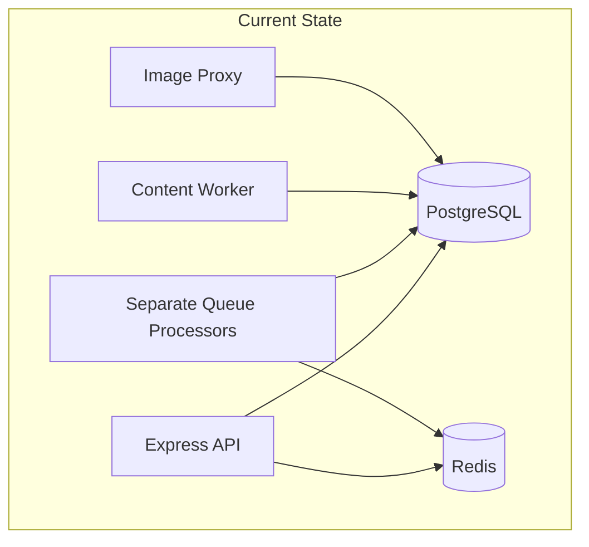
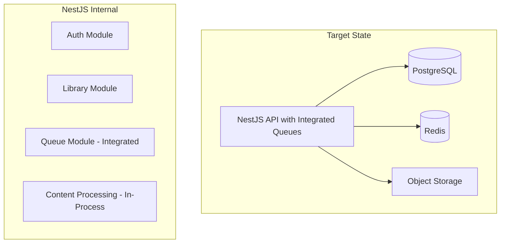
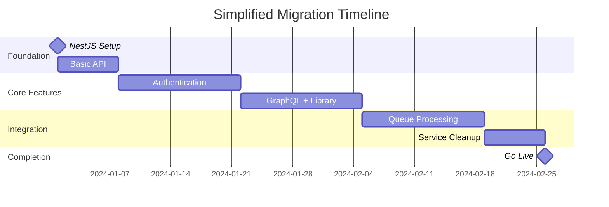

# Simplified NestJS Migration Strategy

## Overview

Since there are no active users, we can simplify the migration approach significantly by:

1. **Direct migration** without progressive traffic rollout
2. **Consolidating queue processing** into the main API service
3. **Reducing service count** for easier maintenance
4. **Implementing in focused slices** rather than parallel workstreams

## Simplified Architecture

### Before: Multi-Service Architecture



### After: Consolidated NestJS Architecture



## Core Functionality Analysis

### Essential Features to Migrate

#### 1. **Authentication System**

- **Current**: `auth_router.ts`, `mobile_auth_router.ts`
- **Target**: `AuthModule` with guards and strategies
- **Priority**: HIGH - Required for all other features

#### 2. **Content Management**

- **Current**: `article_router.ts`, GraphQL resolvers
- **Target**: `LibraryModule` with integrated content processing
- **Priority**: HIGH - Core business logic

#### 3. **GraphQL API**

- **Current**: Apollo Server with scattered resolvers
- **Target**: NestJS GraphQL module with organized resolvers
- **Priority**: HIGH - Primary API interface

#### 4. **Background Processing**

- **Current**: Separate queue-processor service
- **Target**: **Integrated into main API** as NestJS modules
- **Priority**: MEDIUM - Can be consolidated

#### 5. **Content Ingestion**

- **Current**: Separate content-handler service
- **Target**: **Integrated background processing** within API
- **Priority**: MEDIUM - Simplified architecture

## Queue Processing Integration Strategy

### Why Integrate Queues into API?

#### **Advantages of Integration**

```typescript
// Single NestJS Application with Integrated Queues
@Module({
  imports: [
    // Main API modules
    AuthModule,
    LibraryModule,
    GraphQLModule,

    // Integrated queue processing
    BullModule.forRoot({
      redis: { host: 'localhost', port: 6379 },
    }),
    BullModule.registerQueue({
      name: 'content-processing',
      processors: [ContentProcessor], // In-process
    }),
  ],
})
export class AppModule {}
```

#### **Benefits**:

1. **Reduced Deployment Complexity**: One service instead of 3-4
2. **Shared Dependencies**: Database connections, configuration, logging
3. **Simplified Monitoring**: Single application to monitor
4. **Lower Resource Usage**: Shared memory, connections, and processes
5. **Easier Development**: Single codebase, unified testing

#### **Resource Comparison**:

| Approach       | Services   | Memory Usage | Connections        | Complexity |
| -------------- | ---------- | ------------ | ------------------ | ---------- |
| **Current**    | 4 services | ~1.5GB total | 12+ DB connections | High       |
| **Integrated** | 1 service  | ~512MB total | 3-5 DB connections | Low        |

### Background Processing Implementation

```typescript
// packages/api-nest/src/queue/content-processor.ts
@Processor('content-processing')
export class ContentProcessor {
  constructor(
    private contentService: ContentService,
    private libraryService: LibraryService
  ) {}

  @Process('extract-content')
  async processContent(job: Job<ContentJob>) {
    const { url, libraryItemId } = job.data

    try {
      // Extract content (in-process, not separate service)
      const content = await this.contentService.extract(url)

      // Update library item
      await this.libraryService.updateContent(libraryItemId, content)

      return { success: true, contentLength: content.length }
    } catch (error) {
      throw new Error(`Content processing failed: ${error.message}`)
    }
  }
}

// Integration in main module
@Module({
  imports: [
    BullModule.registerQueue({
      name: 'content-processing',
      processors: [ContentProcessor],
    }),
  ],
  providers: [ContentProcessor],
})
export class ContentModule {}
```

## Image Proxy Analysis

### Current Image Proxy vs Background Processing

#### **Image Proxy Approach** (Current)

```typescript
// Separate service running continuously
app.get('/proxy/:imageUrl', async (req, res) => {
  const imageUrl = req.params.imageUrl
  const processedImage = await processImage(imageUrl)
  res.send(processedImage) // Real-time processing
})
```

**Pros**:

- Real-time image processing
- Caching at proxy level
- Independent scaling

**Cons**:

- **Always running** - consumes RAM even when idle
- Additional service to maintain
- Network overhead between services

#### **Background Processing Approach** (Recommended)

```typescript
// Process images during content ingestion
@Process('process-images')
async processImages(job: Job<ImageProcessingJob>) {
  const { images, libraryItemId } = job.data;

  const processedImages = await Promise.all(
    images.map(async (imageUrl) => {
      const optimized = await this.imageService.optimize(imageUrl);
      await this.storageService.store(optimized);
      return optimized.url;
    })
  );

  await this.libraryService.updateImages(libraryItemId, processedImages);
}
```

**Pros**:

- **No idle RAM usage** - only runs when needed
- Pre-processed images = faster loading
- Integrated with content pipeline
- Simpler architecture

**Cons**:

- No real-time processing
- Initial processing delay

### **Recommendation**: Background Processing

For Omnivore's use case, background processing is better because:

1. **Articles are saved once, read many times** - pre-processing makes sense
2. **No active users** - processing delay is not critical
3. **Resource efficiency** - no idle RAM consumption
4. **Simpler deployment** - one less service to manage

## Implementation Slices

### Slice 1: Core API Foundation (Week 1-2)

**Goal**: Basic NestJS API with health checks

```typescript
// Deliverables
- NestJS application structure
- Health check endpoints
- Basic configuration
- Docker integration
```

**Acceptance Criteria**:

- [x] NestJS app boots successfully
- [x] Health endpoints respond
- [x] Docker container runs
- [x] Basic logging works

### Slice 2: Authentication Migration (Week 3-4)

**Goal**: Complete auth system in NestJS

```typescript
// Deliverables
@Module({
  imports: [JwtModule, PassportModule],
  controllers: [AuthController],
  providers: [AuthService, JwtStrategy, GoogleStrategy],
})
export class AuthModule {}
```

**Acceptance Criteria**:

- [x] JWT authentication working
- [x] OAuth providers integrated
- [x] All auth endpoints migrated
- [x] Session management functional

### Slice 3: GraphQL & Library Core (Week 5-6)

**Goal**: Primary API functionality

```typescript
// Deliverables
@Module({
  imports: [GraphQLModule.forRoot({...})],
  providers: [LibraryResolver, ArticleResolver],
})
export class GraphQLModule {}
```

**Acceptance Criteria**:

- [x] GraphQL schema operational
- [x] Article CRUD operations
- [x] Library management
- [x] Search functionality

### Slice 4: Integrated Background Processing (Week 7-8)

**Goal**: Queue processing within API

```typescript
// Deliverables
@Module({
  imports: [
    BullModule.registerQueue({ name: 'content' }),
    BullModule.registerQueue({ name: 'images' }),
  ],
  providers: [ContentProcessor, ImageProcessor],
})
export class QueueModule {}
```

**Acceptance Criteria**:

- [x] Content processing integrated
- [x] Image processing background jobs
- [x] Queue monitoring functional
- [x] Error handling robust

### Slice 5: Service Consolidation (Week 9)

**Goal**: Decommission separate services

**Tasks**:

- [x] Migrate remaining Express endpoints
- [x] Decommission queue-processor service
- [x] Decommission content-handler service
- [x] Update Docker Compose configuration

## Simplified Deployment

### Single-Service Docker Compose

```yaml
# docker-compose.simplified.yml
version: '3.8'
services:
  omnivore-api:
    image: omnivore/nest-api:latest
    environment:
      - NODE_ENV=production
      - ENABLE_QUEUES=true # Integrated queue processing
      - ENABLE_CONTENT_PROCESSING=true
      - ENABLE_IMAGE_PROCESSING=true
    ports:
      - '4000:4000'
    depends_on:
      - postgres
      - redis

  postgres:
    image: postgres:15-alpine
    # ... database config

  redis:
    image: redis:7-alpine
    # ... redis config

  web:
    image: omnivore/web:latest
    # ... web client config
```

### Resource Allocation

| Service                      | CPU           | Memory    | Storage  |
| ---------------------------- | ------------- | --------- | -------- |
| **NestJS API** (with queues) | 1.0 cores     | 512MB     | -        |
| **PostgreSQL**               | 0.5 cores     | 256MB     | 20GB     |
| **Redis**                    | 0.1 cores     | 128MB     | 2GB      |
| **Web Client**               | 0.1 cores     | 64MB      | -        |
| **Total**                    | **1.7 cores** | **960MB** | **22GB** |

Compare to current multi-service:

- **Current**: 2.5 cores, 1.5GB memory, 4 services
- **Simplified**: 1.7 cores, 960MB memory, 1 service
- **Savings**: 32% CPU, 36% memory, 75% fewer services

## Migration Timeline (Simplified)



**Total Timeline**: 8 weeks instead of 18 weeks

## Success Metrics

### Technical Metrics

- **Service Count**: 4 → 1 (75% reduction)
- **Memory Usage**: 1.5GB → 960MB (36% reduction)
- **Deployment Complexity**: High → Low
- **Maintenance Overhead**: High → Low

### Development Metrics

- **Code Consistency**: Unified NestJS patterns
- **Testing**: Integrated test suite
- **Monitoring**: Single application to monitor
- **Documentation**: Consolidated architecture docs

## Next Steps

1. **Week 1**: Set up NestJS foundation (Slice 1)
2. **Week 2**: Migrate authentication (Slice 2)
3. **Week 3-4**: GraphQL and library features (Slice 3)
4. **Week 5-6**: Integrate background processing (Slice 4)
5. **Week 7**: Service consolidation (Slice 5)
6. **Week 8**: Testing and go-live

This simplified approach leverages the advantage of having no active users to create a cleaner, more maintainable architecture with significantly reduced operational complexity.
