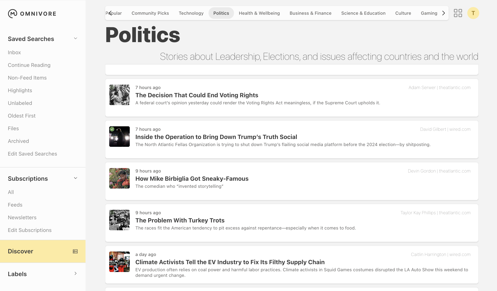
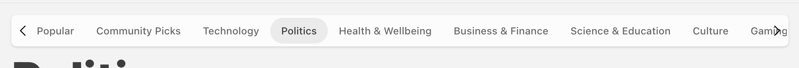
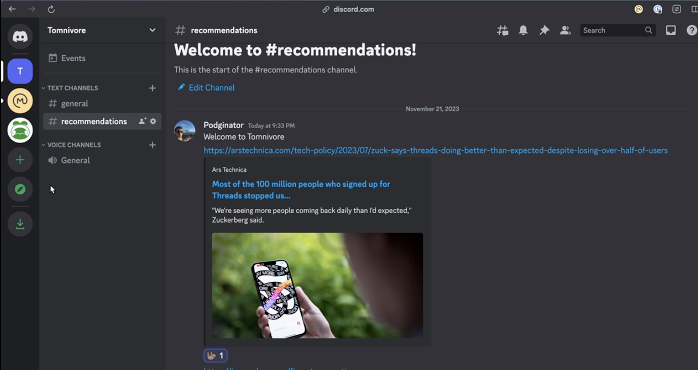
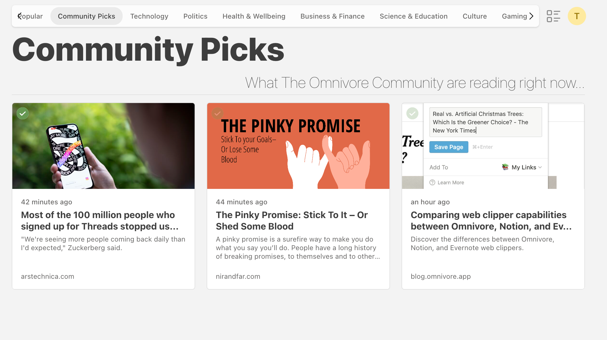
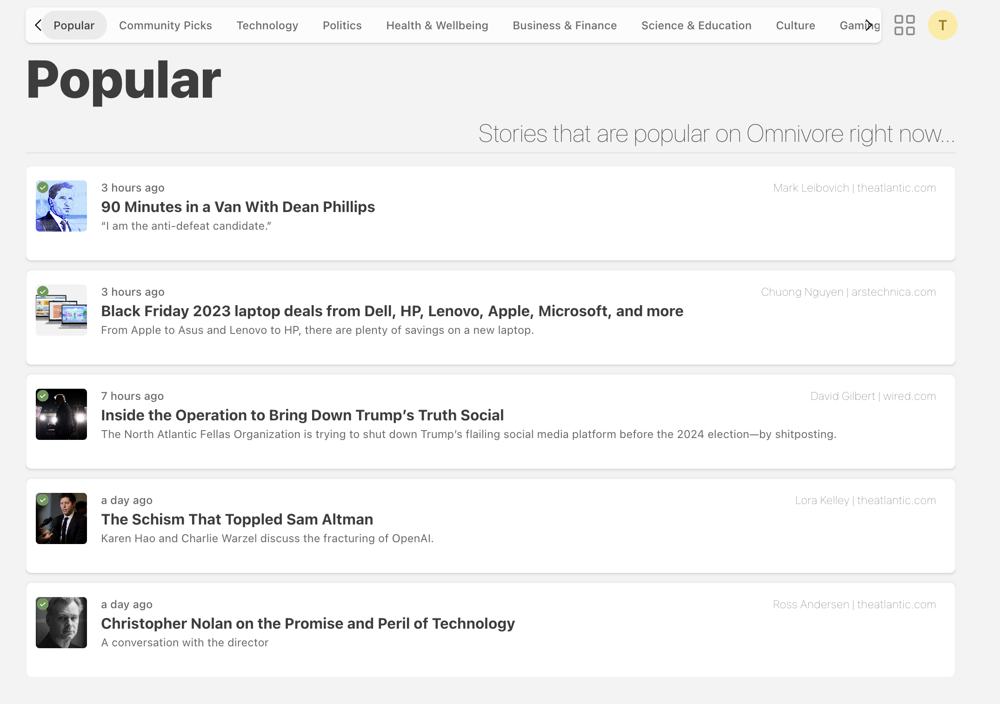

# omnivore-discover

## What is this?  
 
One of my bi ggest problems is actually discoverability of articles. I have my five sites, and my link aggregators like Reddit. This is a bubble, and I miss a lot this way.

So I wanted to see if I could create something that would enable discoverability from Omnivore.

I had a few goals when creating Omnivore Discover.

## Features

### Automatic Categorisation

A while ago I worked a proof of concept for automatically adding user tags to an article. I ultimately still need to work on that further, but the basics for it worked well.

I wanted to take the learnings from this and use it to add automatic categorisation of stories.

I created a few topics, and added some descriptions to them. I generate an Embedding from this using OpenAIs embedding. These can be seen below.

When ingesting articles (see Ingesting Articles) we use their title and small description to create an Embedding. We can then use Cosine Similarity to identify which category this story should be a part of.

This is of course not 100% accurate, but it does a good enough job at categorising articles.

### Social Features
#### Discord Integration.

I created Omnivore Discover, and added it to the Omnivore WebApp.

I wanted to also add some social features to this. We have a fantastic community within the Omnivore Discord. I have found a lot of interesting reads in the #recommendations channel.

I wanted to be able to take these recommendations, and expose them to the Omnivore Community.

We do this using a Discord Bot. In order to moderate these recommendations a moderator must add an emoji (🦥) to the story.

This then gets ingested in the same way as the other stories. Meaning that it is also categorised. It also gets added to the Community Picks tab.

#### Popularity

There is also a popularity feed. This provides a score based on recent saves, weighting more heavily for newer articles. This allows us to have a popular tab, which shows in order the most popular stories on Omnivore Right now according to the community

### Ingesting Articles

I ensured that articles could come from multiple locations. This is why I chose an RXJS Poller.

This project also started from the automatic labelling project. So that too was an important part of the decision to enable ingestion from multiple plages. Including a PubSub queue.

I wanted one of the main sources of the articles to be RSS Feeds.

I did this because I thought that some of this functionality might, in the future, be extendable to other RSS Feeds.

I have chose 3 article sources for now, Wired, ArsTechnica, and The Atlantic.

## Technologies

Below is a list of the technologies that were used to design this feature. This repository represents the RXJS side.

* RxJS 
* Typescript 
* Axios 
* PGVector
* Discord Bot
* PubSub

## Running

Creation of the PubSub Topic and Subscription is external to this app.
