# Self Hosting

- [Docker Compose](#docker-compose)
- [Nginx Reverse Proxy](#nginx-reverse-proxy)
- [Cloudflare Tunnel](#cloudflare-tunnel)
- [Web Extensions](#web-extensions)
- [Email](#email)
- - [IMap Watcher](#imap-watcher)
- - [Self Hosted Mail Server](#docker-mailserver-and-mail-watcher)
- - [Third Party Services](#third-party-services)
- [YouTube Transcripts](#youtube-transcripts)

## Docker Compose

We recommend using Docker-compose for the simplest way to deploy Omnivore. We have provided a configuration in the `self-hosting/docker-compose` folder. 

All networking and persistent storage is handled by the docker-compose file.

### Requirements
* Docker 
* Docker Compose 

### 1. Clone the Repository

Clone the repository at ``git@github.com:omnivore-app/omnivore.git``

### 2. Change directory to self-hosting/docker-compose

The Docker-compose file and necessary environment variables are found in the self-hosting folder under docker-compose. 

These files provide all you need to get Omnivore up and running on your local environment. 

This will pull some premade images. If you want to build these images yourself, you can use the file found in self-hosting/docker-compose/self-build. You might want to do this if you are making development adjustments.  

### 3. Populate the .env file 

There is a .env.example file located within the docker-compose folder that should give you the necessary environment variables to begin running. 
You can use these by `mv .env.example .env`

The following environment variables should be changed to reflect where you are running your application. 

| Environment Variable            | Description                                    | Local Parameter       |
|---------------------------------|------------------------------------------------|-----------------------|
| BASE URL                        | The URL of the Front End of the Application.   | http://localhost:3000 |
| SERVER_BASE_URL                 | The URL of the API Server.                     | http://localhost:4000 |
| HIGHLIGHTS_BASE_URL             | The URL of the Front end of the Application    | http://localhost:3000 |
| CLIENT_URL                      | The URL of the Front end of the Application    | http://localhost:3000 |
| IMAGEPROXY_URL                  | Service that proxies images to avoid blocking  | http://localhost:7070 |


They are the same as the listed environment variables above. 


### 4. Start the service. 

Running `docker compose up` will pull the images from the github, and then start the services. 

During the first deployment omnivore-migrate will go through and set up the necessary Postgres tables. 
This will also create a demo user with email: demo@omnivore.app, password: demo_password. 

When the service is ready you can access the web-app by using localhost:3000

With the default .env file you will be able to use Omnivore, add RSS Feeds, add stories etc. 


### Additional Services used: 

#### PGVector
A PGVector image is used to provide Postgres functionality. If you have another postgres service running it is possible to remove 
this from the docker-compose and provide the host, username and password of the Postgres instance. 

#### Redis 
Redis is used as a queueing system, and for caching. If you have a Redis Instance already it is possible to remove this from the docker-compose 
and rely on the hosted Redis. You must replace the redis url for this. 

#### Minio (Self-Host)
Minio is an AWS S3 compatible Object storage service that you can self-host. It is included in the docker-compose file. 
It allows you to use the S3 Storage API. 

We also have a small client that creates the necessary buckets (createbuckets). See below: 
```bash
until (/usr/bin/mc config host add myminio http://minio:9000 minio miniominio) do echo '...waiting...' && sleep 1; done;
/usr/bin/mc mb myminio/omnivore;
/usr/bin/mc policy set public myminio/omnivore;
```

If you use GCS, or S3 buckets you can do the following:

##### S3 (Optional): 
S3 is an AWS Block Storage Service. You can also use S3 as your storage service, rather than the included MinIO self-host. In order to use S3, you must do the following.

Replace the following with the correct parameters. 
```env
AWS_ACCESS_KEY_ID=minio   # Used for Minio S3 Client
AWS_SECRET_ACCESS_KEY=miniominio
AWS_REGION=us-east-1
```

Replace the following with an endpoint URL from [here](https://docs.aws.amazon.com/general/latest/gr/s3.html)
```env
LOCAL_MINIO_URL=http://localhost:1010

```

##### GCS (Optional): 
Remove the following Environment Variable: 
```env
GCS_USE_LOCAL_HOST=true
```
and populate 
```
GCS_UPLOAD_SA_KEY_FILE_PATH
```
with the path of the JSON key file for the service account.

## Nginx Reverse Proxy

Nginx is a reverse proxy that receives requests, and directs them to the correct service internally. Omnivore runs 4 services we want to redirect to.

* Omnivore Web
* Omnivore API
* Omnivore Bucket [Optional]
* Omnivore Image Proxy [Optional]

We have included an example Nginx Configuration that redirects traffic from http (80) to https (443), and then directs traffic to the correct service based on the request path. 

[Link to nginx.conf here](../self-hosting/nginx/nginx.conf)

## Cloudflare Tunnel
Cloudflare tunnels is an easy way to expose a service running on a local machine to the internet without a publicly routable IP Address. 

You run a daemon on your host machine, which creates outbound connections to the


Omnivore is no way affiliated with Cloudflare, it is just the method to which the person writing this guide used, and found pretty painless overall.

[Read More](https://www.cloudflare.com/products/tunnel/)

## Web Extensions
The web extensions have been updated to support self-hosting - The manifest version 2 of these could be enabled to work with Self-hosting, but required some manual code changes.

The extension has been updated for Manifest v3, and to hopefully ease the difficulty of making it work with Self-Hosted versions.

These extensions have been sent for submission to the Chrome and Firefox webstore, but are awaiting approval. In the mean-time, a guide about how to install these manually is provided. 

### Chrome

1. Navigate to the Chrome extension page at Chrome://extensions
   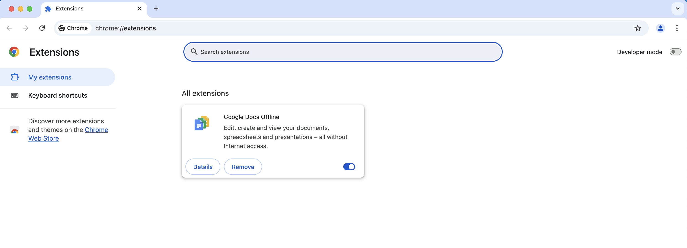

2. Enable Developer mode on the Extensions page using the toggle.
   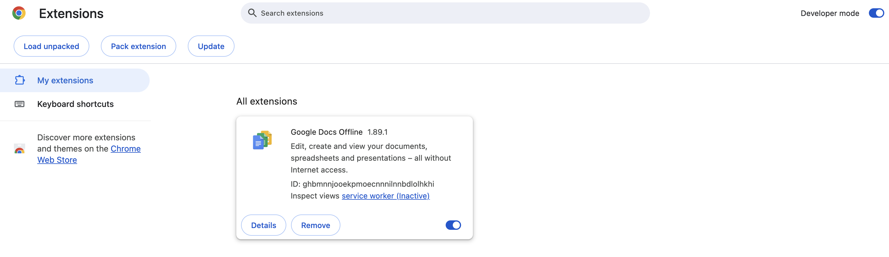
3. Use the Load Unpacked Option to load the extension from source. 
   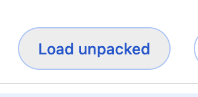
4. Navigate to the source folder, found at pkg/extension-v3/extension
   
   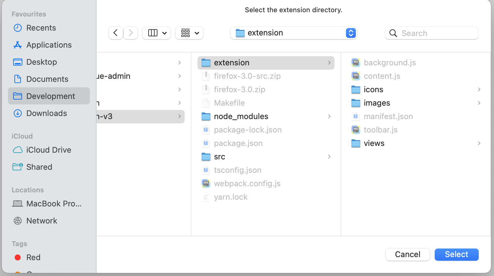
5. The extension should have been installed. Go to the details page on the newly installed extension
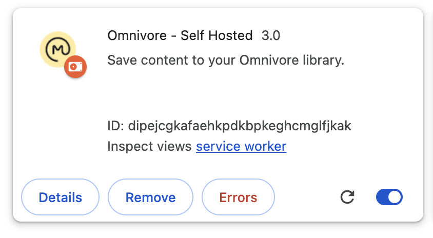
6. Navigate to the options page, using the "Extensions Options" button. You should see the following page.
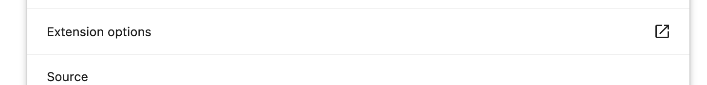
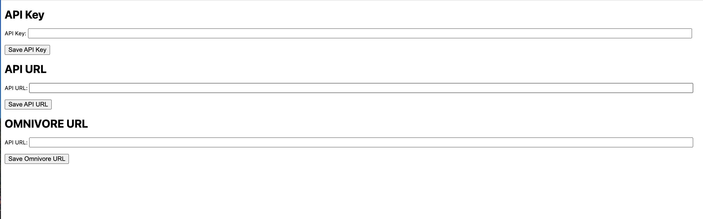
7. Generate an API Key using Omnivore.
   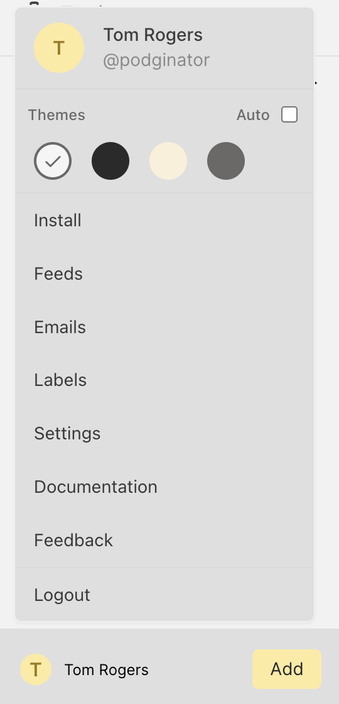
   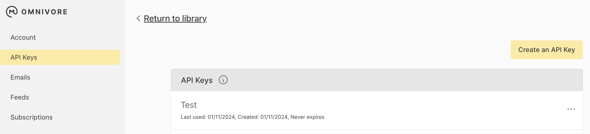
   
   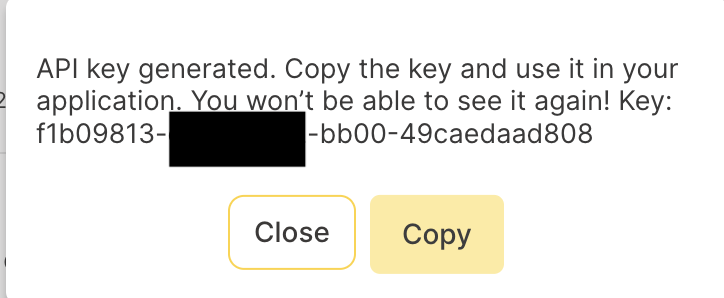
8. Update the settings with the hosted options
   


## Emails and Newsletters

Another Feature of Omnivore is the ability to receive Newsletters directly into your Inbox using email. This feature is described more [here](#receiving-newsletter-subscriptions-via-email).

This works by generating an email address, and subscribing to a newsletter using that email address. 

In order to get this working in a self-hosted way we have created a new endpoint that allows you to send an API request with the emails contents.  

We will go over 

#### Receiving Newsletter Subscriptions via Email
1. On the Omnivore website or app, tap your photo, initial, or avatar in the top right corner to access the profile menu. Select Emails from the menu.

2. Tap Create a New Email Address to add a new email address (e.g. username-123abc@inbox.omnivore.app) to the list.

3. Click the Copy icon next to the email address.

4. Navigate to the signup page for the newsletter you wish to subscribe to.

5. Paste the Omnivore email address into the signup form.

6. New newsletters will be automatically delivered to your Omnivore inbox.

### IMap Watcher

One of the easiest ways to get this functionality up and running is to use an existing email box, such as gmail. 

We have included a docker file `self-hosting/docker-compose/mail/imap-parser/docker-compose-imap`. 

There are a few environment variables that need to be set to make this work.

| Environment Variable | Description                                                                                          | .env example                      |
|----------------------|------------------------------------------------------------------------------------------------------|-----------------------------------|
| WATCHER_API_KEY      | The API Key for the Watcher Service.                                                                 | api-key                           |
| WATCHER_API_ENDPOINT | The URL of the Watcher Server.                                                                       | https://omnivore-watch.domain.tld |
| IMAP_USER            | The IMAP User, in the gmail case this will be your email                                             | email-address@emailserver.com     |
| IMAP_PASSWORD        | For gmail, this will be an application password. for other services this will be your email-password | password                          |
| IMAP_HOST            | The IMAP Host, for gmail this will be imap.gmail.com                                                 | imap.host.com                     |
| IMAP_PORT            | The IMAP Port, usually 993                                                                           | 993                               |
| OMNIVORE_EMAIL       | The email address that Omnivore Creates                                                              | uuid@omnivore.tld                 |

We will show how to set this up with a gmail account below. The steps should be similar for different email services. 

#### GMail: How to

##### Step 1. Create an Omnivore Email


This is the email address that you will use for the .env.imap file, `OMNIVORE_EMAIL`

##### Step 2. Enable imap on GMail. 
Note: For this step, I would recommend creating a separate email account rather than using your own email account. This functionality works by tracking which emails have already been opened, and automatically opens emails. 

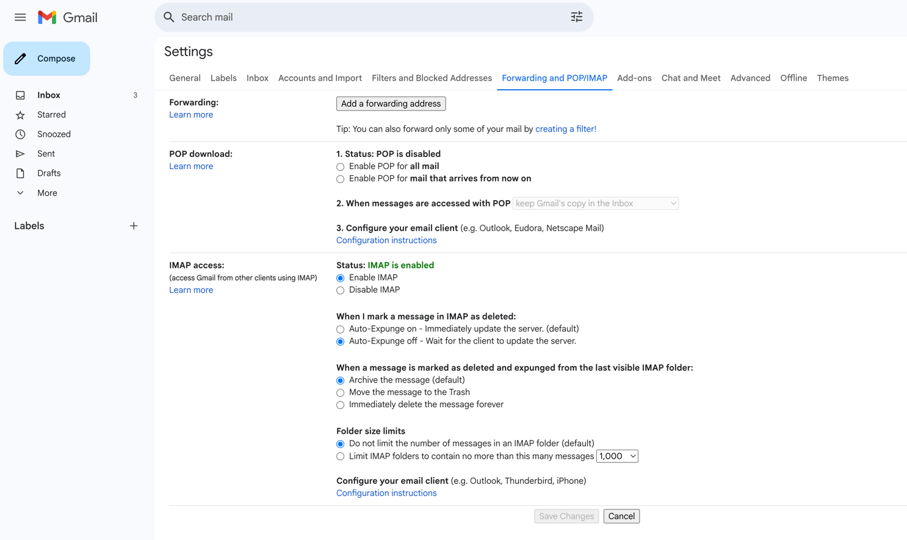

This is located in your gmail settings. 

##### Step 3. Enable Application Passwords for Email. 
For gmail, the password we need to use is an application password. In order to use these, we first have to enable multi-factor authentication for this account. 

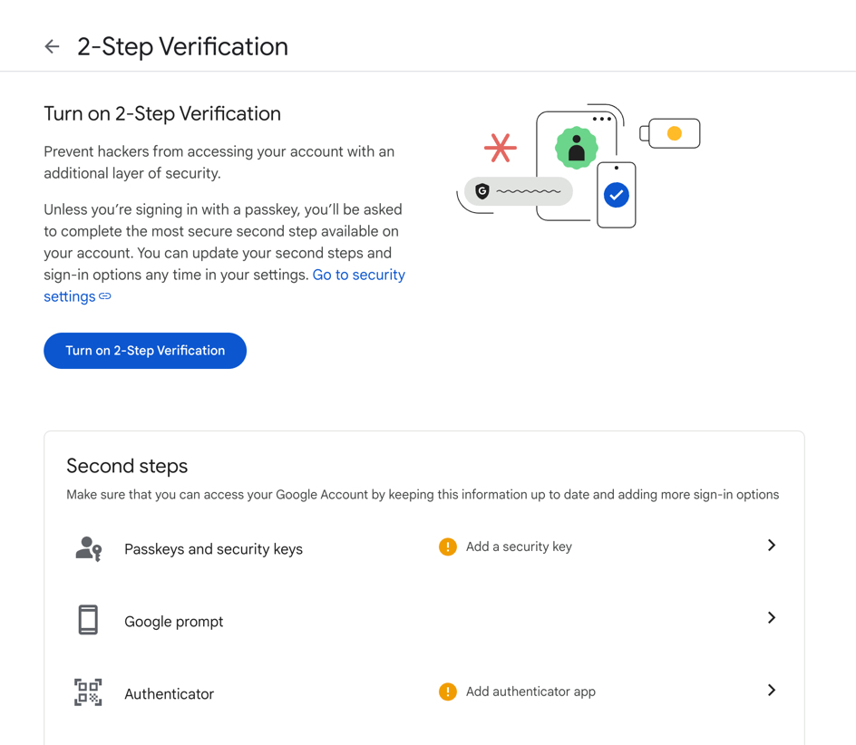

Then follow the link here: https://myaccount.google.com/apppasswords to create an application password. 

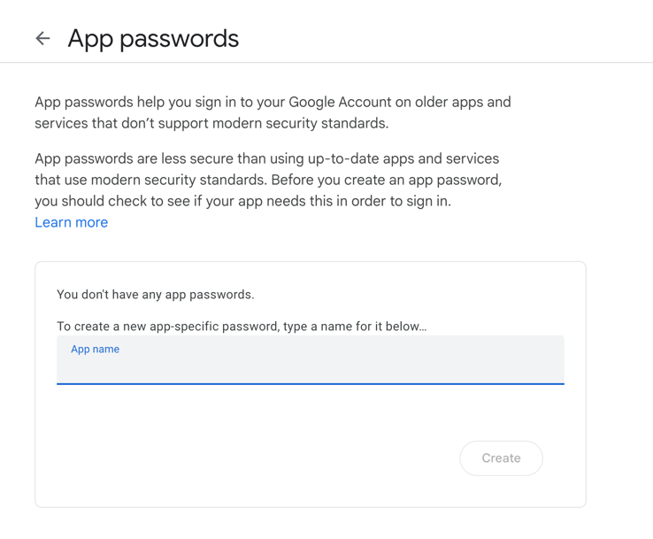

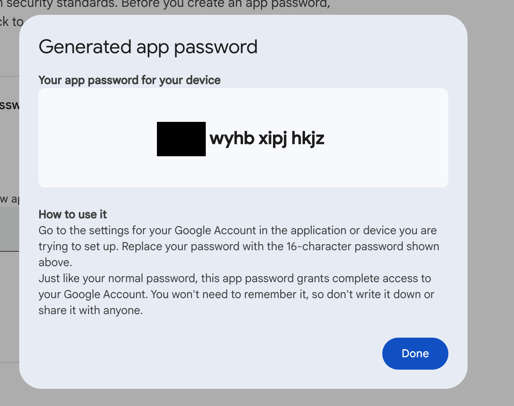

This will be the password for the `IMAP_PASSWORD`. 

#### Step 4. Run docker compose up 
`cd self-hosting/docker-compose/mail/imap-parser`
`docker compose -f docker-compose-imap.yml build`
`docker compose -f docker-compose-imap.yml up`

#### Step 5. Emails are sent to Omnivore 


### Docker-mailserver and mail-watcher

One way to get this functionality back is to host your own mail server. In this example we will only be using this mail server as an incoming mailbox to receive emails. I would not recommend this method, as it's largely more effort  than it is worth.  

We have used [Docker-mailserver](https://docker-mailserver.github.io) here. A guide on how to set this up is found [here](https://docker-mailserver.github.io/docker-mailserver/latest/examples/tutorials/basic-installation/). 

We have included a docker file `self-hosting/docker-compose/mail/docker-compose-mail`. This file does a few things.

* Setups Docker-mailserver with minimal settings. 
* Creates a user `user@domain.tld` where `domain.tld` is your email servers domain. 
* Reroutes all mail from `*@domain.tld` to `user@domain.tld`
* Watches for any new mail incoming, converts it to a payload for the mail proxy, and forwards it on. 

There are a few environment variables that need to be set. 

```.env
WATCHER_API_KEY=mail-api-key # The API Key that runs the mail-watcher-api 
MAIL_FILE_PATH=/var/mail/domain.tld/user/new # where domain.tld is the name of your domain
WATCHER_API_ENDPOINT=https://omnivore-watch.domain.tld # The hosted watcher api - where mail is proxied to and processed.
```

Additionally you need to change a few things in the docker-file. 

```
hostname: mail.domain.tld
```
```
    environment:
      - DOMAIN="domain.tld"
```
```
docker exec -ti mailserver setup email add user@domain.tld pass123;
echo '@domain.tld user@domain.tld' > /tmp/docker-mailserver/config/postfix-virtual.cf
```
replace domain.tld with your mail servers domain. 

Additionally you need to replace the following environment variables for the API. 

```
WATCHER_API_KEY=mail-api-key # The same as the one in the mail server.
LOCAL_EMAIL_DOMAIN=domain.tld # Your email domain.
```

### Third Party Services
Setting up your own email server is a bit overkill for what we are trying to achieve. Below are some additional services that can be used to achieve the mail functionality. These are just a few examples, but others will also work.

#### Amazon Simple Email Service and SNS 

Amazon Simple Email Service (SES) has options for email receiving. We can use this to add the email functionality to Omnivore-self hosted. 

##### Step 1. Create Identity
Create your identity using Amazon SES. This will be your domain. 


##### Step 2. Verify the Domain using the CNAME Records.


#### Step 3. Add the MX Record 

See instructions on how to do that [here](https://docs.aws.amazon.com/ses/latest/dg/receiving-email-mx-record.html)

##### Step 4. Create Email-Receiving Ruleset


##### Step 5. Create SNS Topic Target

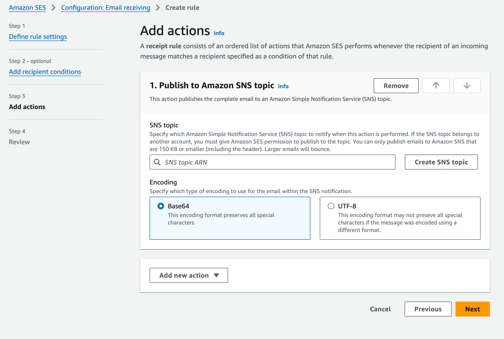


##### Step 6. Setup Subscription
In SNS you must setup a subscription to your Omnivore Host.


##### Step 7. Test by sending email to Omnivore Email


#### Zapier and other Webhook Services. 

If you are just looking for a simple way to import emails into your Self Hosted Omnivore Account, you can use a service like Zapier to forward the email into the mail-proxy. 

Below is a set of instructions to get this working. 

##### Step 1. Create an Omnivore Email 


##### Step 2. Create a Zapier Integration, using Gmail or Equivalent
You can either use your own email with a filter, or alternatively create a new gmail account exclusively for your Newsletters.


##### Step 3. Convert Email into Payload for Webhook. 


For the to object use the email provided in step 1. 

```javascript
return { data: JSON.stringify(inputData) }
```

##### Step 4. Send to Mail Proxy. 

* POST Request
* Use the x-api-key set in your .env file 
* The data is the output from the previous step. 

##### Email Imported

Following these steps you should see your email imported into Omnivore. 


## Youtube Transcripts

Omnivore has the ability to process YouTube Transcripts, using OpenAI to add the necessary grammar, and structure. 

### Guide: 

This features requires the following Environment Variables 

| Environment Variable                      | Description                                                                                   | 
|-------------------------------------------|-----------------------------------------------------------------------------------------------|
| YOUTUBE_TRANSCRIPT_PROMPT                 | The Prompt sent to Open AI to format the Transcript. Default provided in .env.example         |
| YOUTUBE_MAXIMUM_VIDEO_DURATION_TRANSCRIPT | The duration in seconds of the maximum length allowed to be processed. Defaults to 30 minutes. |
| OPENAI_API_KEY                            | The Open AI Key required to send the video to be formatted.                                   |

To learn more about setting up the OpenAI Api key, read here: https://openai.com/index/openai-api/

### Future Releases

In future releases we would like to be able to open this up to use different LLMs, such as Anthropic, Mistral, Bedrock, or any of the other myriad LLM Services.


