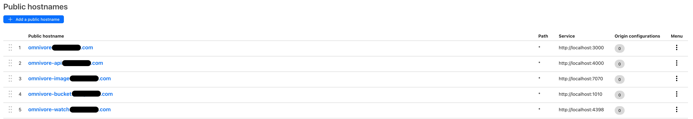

# Self Hosting

- [Docker Compose](#docker-compose)
- [Nginx Reverse Proxy](#nginx-reverse-proxy)
- [Cloudflare Tunnel](#cloudflare-tunnel)

## Docker Compose

We recommend using Docker-compose for the simplest way to deploy Omnivore. We have provided a configuration in the `self-hosting/docker-compose` folder. 

All networking and persistent storage is handled by the docker-compose file.

### Requirements
* Docker 
* Docker Compose 

### 1. Clone the Repository

Clone the repository at ``git@github.com:omnivore-app/omnivore.git``

### 2. Change directory to self-hosting/docker-compose

The Docker-compose file and necessary environment variables are found in the self-hosting folder under docker-compose. 

These files provide all you need to get Omnivore up and running on your local environment. 

### 3. Populate the .env file 

There is a .env.example file located within the docker-compose folder that should give you the necessary environment variables to begin running. 
You can use these by `mv .env.example.env`

The following environment variables should be changed to reflect where you are running your application. 

| Environment Variable             | Description                                    | Local Parameter         |
|----------------------------------|------------------------------------------------|-------------------------|
| BASE URL                         | The URL of the Front End of the Application.   | http://localhost:3000   |
| SERVER_BASE_URL                  | The URL of the API Server.                     | http://localhost:4000   |
| HIGHLIGHTS_BASE_URL              | The URL of the Front end of the Application    | http://localhost:3000   |
| NEXT_PUBLIC_BASE_URL             | Same as above BASE URL, but for NEXT           | http://localhost:3000   |
| NEXT_PUBLIC_SERVER_BASE_URL      | Same as above SERVER_BASE_URL, but for NEXT    | http://localhost:4000   |
| NEXT_PUBLIC_HIGHLIGHTS_BASE_URL  | Same as above HIGHLIGHTS_BASE_URL but for NEXT | http://localhost:3000   |

Additionally, when doing a docker-compose build, if you are hosting this application you must change the args in the `docker-compose` file. 

```yaml
web:
    build:
    context: ../../
    dockerfile: ./packages/web/Dockerfile-self
args:
  - APP_ENV=prod
  - BASE_URL=http://localhost:3000
  - SERVER_BASE_URL=http://localhost:4000
  - HIGHLIGHTS_BASE_URL=http://localhost:3000
```

They are the same as the listed environment variables above. 

### 4. Build the docker images. 

Running `docker compose build` will go through and build all the necessary docker images. 

### 5. Start the service. 

Running `docker compose up` will start the services.

During the first deployment omnivore-migrate will go through and set up the necessary Postgres tables. 
This will also create a demo user with email: demo@omnivore.app, password: demo_password. 

When the service is ready you can access the web-app by using localhost:3000

With the default .env file you will be able to use Omnivore, add RSS Feeds, add stories etc. 


### Additional Services used: 

#### PGVector
A PGVector image is used to provide Postgres functionality. If you have another postgres service running it is possible to remove 
this from the docker-compose and provide the host, username and password of the Postgres instance. 

#### Redis 
Redis is used as a queueing system, and for caching. If you have a Redis Instance already it is possible to remove this from the docker-compose 
and rely on the hosted Redis. You must replace the redis url for this. 

#### Minio
Minio is an AWS S3 compatible Object storage service. It allows you to use the S3 Storage API. 

We also have a small client that creates the necessary buckets (createbuckets). See below: 
```bash
until (/usr/bin/mc config host add myminio http://minio:9000 minio miniominio) do echo '...waiting...' && sleep 1; done;
/usr/bin/mc mb myminio/omnivore;
/usr/bin/mc policy set public myminio/omnivore;
```

If you use GCS, or S3 buckets you can do the following:

##### S3: 
Replace the following with the correct parameters. 
```env
AWS_ACCESS_KEY_ID=minio   # Used for Minio S3 Client
AWS_SECRET_ACCESS_KEY=miniominio
AWS_REGION=us-east-1
```

Replace the following with an endpoint URL from [here](https://docs.aws.amazon.com/general/latest/gr/s3.html)
```env
LOCAL_MINIO_URL=http://localhost:1010

```

##### GCS: 
Remove the following Environment Variable: 
```env
GCS_USE_LOCAL_HOST=true
```
and populate 
```
GCS_UPLOAD_SA_KEY_FILE_PATH
```
with the path of the JSON key file for the service account.

## Nginx Reverse Proxy

Nginx is a reverse proxy that receives requests, and directs them to the correct service internally. Omnivore runs 4 services we want to redirect to.

* Omnivore Web
* Omnivore API
* Omnivore Bucket [Optional]
* Omnivore Image Proxy [Optional]

We have included an example Nginx Configuration that redirects traffic from http (80) to https (443), and then directs traffic to the correct service based on the request path. 

```nginx
events {}

http {
    sendfile    on;
    keepalive_timeout 60;

     upstream omnivore_web {
    	ip_hash;
    	server 127.0.0.1:3000;
     }

     upstream omnivore_backend {
    	ip_hash;
    	server 127.0.0.1:4000;
     }

     upstream omnivore_imageproxy {
    	ip_hash;
    	server 127.0.0.1:1010;
     }

    upstream omnivore_bucket {
    	ip_hash;
    	server 127.0.0.1:7070;
    }

    server {
        listen 80;
        return 301 https://$host$request_uri
    }

    server {
        listen 443;
        server_name  omnivore.domain.com;


        ssl_certification   /path/to/cert.crt;
        ssl_certificate_key /path/to/cert.key;

        ssl on;
        ssl_session_cache builtin:1000 shared:SSL:10m;
        ssl_protocols TLSv1 TLSv1.1 TLSv1.2;
        ssl_ciphers HIGH:!aNULL:!eNULL:!EXPORT:!CAMELLIA:!DES:!MD5:!PSK:!RC4;
        ssl_prefer_server_ciphers on;

        # Override for authentication on the frontend
        location /api/client/auth {
            proxy_pass http://omnivore_web;
        }

        # API
        location /api {
            proxy_pass http://omnivore_backend;
        }

        # Minio
        location /bucket {
            proxy_pass http://omnivore_bucket;
        }

        # ImageProxy
        location /images {
            proxy_pass http://omnivore_imageproxy;
        }

        # FrontEnd application
        location / {
            proxy_pass http://omnivore_web;
        }
    }
}
```

## Cloudflare Tunnel
Cloudflare tunnels is an easy way to expose a service running on a local machine to the internet without a publicly routable IP Address. 

You run a daemon on your host machine, which creates outbound connections to the



Omnivore is no way affiliated with Cloudflare, it is just the method to which the person writing this guide used, and found pretty painless overall.

[Read More](https://www.cloudflare.com/products/tunnel/)
